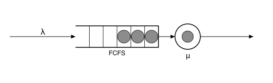

# Concourse.jl

[](https://computingkitchen.com/Concourse.jl/dev/)
[](https://github.com/adolgert/Concourse.jl/actions/workflows/docs.yml)
[](https://github.com/adolgert/Concourse.jl/actions/workflows/CI.yml)
[](https://codecov.io/gh/adolgert/Concourse.jl)

Concourse builds queueing-network models, compiles each one to a generalized
semi-Markov process (GSMP), simulates it with
[CompetingClocks.jl](https://github.com/adolgert/CompetingClocks.jl), and
estimates derivatives of the output with
[ClockGradients.jl](https://github.com/adolgert/ClockGradients.jl).



## Quickstart

The queue in the picture: Poisson arrivals at rate λ = 1, one server at rate
μ = 2. Theory says the long-run number in system is ρ/(1−ρ) = 1 at
utilization ρ = λ/μ = 0.5. The simulation agrees.

```julia
using Concourse
net = QueueNetwork(param_names = (:lambda, :mu))
source!(net, :arrive; interarrival = Law(:Exponential, scale = inv(Param(:lambda))))
station!(net, :counter; discipline = FCFS(), servers = 1,
         service = Law(:Exponential, scale = inv(Param(:mu))))
sink!(net, :done)
route!(net, :arrive, Always(:counter))
route!(net, :counter, Always(:done))
model = compile(net)
record = simulate(model, [1.0, 2.0], 2000.0; seed = 42)
time_average(number_in_system, model, record)  # ≈ 1.0
```

## Installation

Concourse and ClockGradients are not yet registered, so install both by URL.
CompetingClocks is registered and installs automatically.

```julia
using Pkg
Pkg.add(url = "https://github.com/adolgert/ClockGradients.jl")
Pkg.add(url = "https://github.com/adolgert/Concourse.jl")
```

## Limitations

Mark laws that read a parameter are refused under branching worlds
(`branch_world` raises an `ArgumentError`): a θ-dependent mark law would
add a derivative term of its own to every estimator, and that term is not
implemented. The
[branching manual page](https://computingkitchen.com/Concourse.jl/dev/manual/branching/)
covers what is and is not admitted.

State-dependent service laws (`InService`/`InBuffer`) are refused under
branching worlds for the same kind of reason: pathwise IPA is not
guaranteed unbiased for them, because reordering events changes an
occupancy — and with it the law itself — discontinuously. The score
estimator remains valid on their records. The
[state-dependent service laws page](https://computingkitchen.com/Concourse.jl/dev/manual/state_dependent/)
explains the segment convention and keeps the estimator-validity table.

Batch service (`Batching`) carries a milder caveat in the same family:
the batch size is integer-valued, so pathwise IPA is not guaranteed
unbiased — a perturbation that changes which jobs are gathered moves the
path by whole jobs. The score estimator remains valid on batch records.
The
[batch service page](https://computingkitchen.com/Concourse.jl/dev/manual/batching/)
covers the semantics, including that a batch member meeting a full
`:block` destination is dropped.

## Documentation

The [documentation](https://computingkitchen.com/Concourse.jl/dev/) has a
queueing tutorial taught through simulations, a research manual (records and
replay, trajectory splitting, gradient estimation), an API reference, and a
developer section on the design. The original design notes live in `notes/`.

## Formatting

Code style is configured in `.JuliaFormatter.toml` (blue style). Format with
`using JuliaFormatter; format(".")` before submitting changes.

## License

Concourse is MIT licensed.
