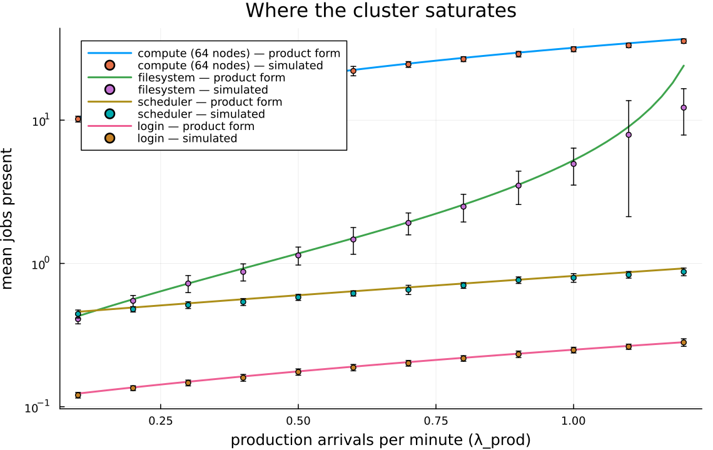
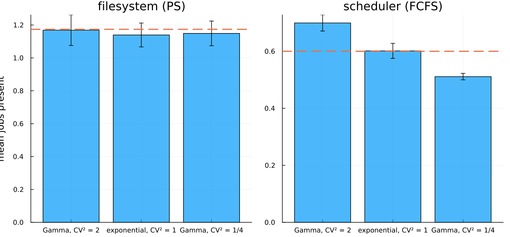

# A BCMP model of a high-performance computing cluster

This page walks through `examples/bcmp_hpc.jl`: a multi-class queueing
network model of an HPC cluster, checked against the exact theory of BCMP
networks, with two experiments that show what the theory promises and
where its promises stop.

## What a BCMP network is

In 1975, Baskett, Chandy, Muntz, and Palacios proved a remarkable
theorem. Take a network of queues. Let jobs belong to classes, move
between stations according to probabilities, and demand different amounts
of service by class. Then, **if every station is one of four types**, the
stationary distribution of the whole network factorizes: the network
behaves, in the long run, as if its stations were independent queues,
each with a simple closed-form distribution. This is called a
*product-form* solution, and the four station types are:

1. **FCFS with exponential service.** One or more servers, first come
   first served. The price of this type: every class must have the *same
   exponential* service distribution. First come first served makes
   waiting jobs interchangeable, so the theory only survives if their
   remaining-work distributions are interchangeable too — which forces
   the memoryless law.
2. **Processor sharing.** Everyone at the station is served at once,
   each at an equal fraction of the server's speed. Service laws may be
   *general* and *class-dependent*.
3. **Infinite server** (a *delay* station). Every arrival gets its own
   server; nobody waits. Laws general and class-dependent.
4. **LCFS preemptive-resume.** Last come first served, with preemption.
   Laws general and class-dependent.

The asymmetry between type 1 and the others is the interesting part.
Types 2–4 have a property called *insensitivity*: their occupancy
distribution depends on the service law only through its **mean**. You
can replace an exponential service with a Gamma, a deterministic value,
or a heavy-tailed law of the same mean, and the station's long-run
occupancy does not move. Type 1 has no such property, and the second
experiment below shows both facts side by side.

## The cluster

```@example bcmp_diagrams
using Luxor, QueueDiagrams, LaTeXStrings # hide
@drawsvg begin # hide
    background("white") # hide
    fontface("Helvetica") # hide
    yrow = -50 # hide
    login = sharedserver(Point(-300, yrow), 30; jobs = [1, 2], label = "login (PS)") # hide
    bc = Point(-175, yrow) # hide
    b = buffer(bc, 100, 34; slots = 4, jobs = [2, 1]) # hide
    discipline(bc, 100, 34, "sched (FCFS)") # hide
    sv = server(Point(-95, yrow), 17; inservice = 1) # hide
    compute = sharedserver(Point(55, yrow), 48; # hide
                           jobs = [1, 2, 1, 2, 2, 1, 2, 1], label = "compute (64 nodes)") # hide
    fs = sharedserver(Point(55, 105), 26; jobs = [2, 1], label = "fs (PS)") # hide
    flow(Point(-430, yrow - 22), Point(login.entry.x - 4, yrow - 8); label = L"\lambda_{debug}") # hide
    flow(Point(-430, yrow + 22), Point(login.entry.x - 4, yrow + 8); label = L"\lambda_{prod}") # hide
    flow(login.exit, b.entry) # hide
    flow(b.exit, sv.entry) # hide
    flow(sv.exit, compute.entry) # hide
    flow(compute.exit, Point(250, yrow); label = "0.25") # hide
    fontsize(13); text("done", Point(262, yrow + 4)) # hide
    flow(Point(80, yrow + 44), Point(80, 82)) # hide
    flow(Point(30, 82), Point(30, yrow + 44)) # hide
    fontsize(13) # hide
    text("0.75", Point(95, 45), halign = :left) # hide
    text("checkpoint", Point(16, 45), halign = :right) # hide
end 900 300 # hide
```

The network: two job classes (debug in blue, production in orange) pass
through a processor-sharing login node, a first-come-first-served
scheduler, a 64-node compute pool, and a processor-sharing filesystem
that jobs cycle through while checkpointing.

Two classes of work arrive at a cluster:

| class | arrivals | login | compute burst | checkpoint write |
|---|---|---|---|---|
| debug | 2.0 /min | 0.05 min | 1.0 min | 0.04 min |
| production | 0.5 /min | 0.10 min | 6.0 min | 0.20 min |

Every job passes through four resources:

- **login** — the login node, where users prepare a submission. Modeled
  as processor sharing (interactive shells share the CPU), with a
  class-dependent Gamma service law. BCMP type 2.
- **sched** — the scheduler, one server, FCFS, exponential service with
  the *same* mean for both classes (0.15 min). BCMP type 1, and the
  class-independence is required, not a simplification we chose.
- **compute** — 64 nodes, one job per node. At our loads a job
  essentially never waits, so this is a *delay* station. BCMP type 3.
- **fs** — the parallel filesystem, modeled as processor sharing.
  BCMP type 2.

After each compute burst, a job checkpoints to the filesystem with
probability p = 0.75 and then computes again; with probability 0.25 it
leaves. So a job makes a geometric number of compute visits — 4 on
average, with 3 filesystem visits — and the network has a cycle in it,
which the theory handles without complaint.

Class-dependent service travels as **marks**: each source stamps its jobs
with its class's service scales, and the station laws read the marks.
This is the same recorded-randomness machinery the rest of Concourse
uses — every mark and every routing coin flip is drawn from a keyed
stream and written into the record, so any run replays exactly.

```julia
source!(net, :prod_in;
        interarrival = Law(:Exponential, scale = inv(Param(:lambda_prod))),
        mark = MarkLaw(class = Law(:Dirac, value = Const(1.0)),
                       login_s = Law(:Dirac, value = Const(0.10)),
                       comp_s  = Law(:Dirac, value = Const(6.0)),
                       io_s    = Law(:Dirac, value = Const(0.20))))
station!(net, :login; discipline = ProcessorSharing(), servers = 1,
         service = Law(:Gamma, shape = Const(2.0),
                       scale = Const(0.5) * Mark(:login_s)))
station!(net, :sched; discipline = FCFS(), servers = 1,
         service = Law(:Exponential, scale = Const(0.15)))
station!(net, :compute; discipline = FCFS(), servers = 64,
         service = Law(:Exponential, scale = Mark(:comp_s)))
station!(net, :fs; discipline = ProcessorSharing(), servers = 1,
         service = Law(:Exponential, scale = Mark(:io_s)))
route!(net, :compute, Probabilistic(:fs => 0.75, :done => 0.25))
route!(net, :fs, Always(:compute))
```

## The closed forms

Product form makes the predictions elementary. First solve the *traffic
equations* — each station's total arrival rate, counting revisits. The
checkpoint loop turns one external arrival into a geometric number of
internal visits:

```@example bcmp_diagrams
@drawsvg begin # hide
    background("white") # hide
    fontface("Helvetica") # hide
    stations = [("login", 1), ("sched", 1), ("compute", 4), ("fs", 3)] # hide
    for (i, (name, visits)) in enumerate(stations) # hide
        x = -240 + (i - 1) * 160 # hide
        server(Point(x, 0), 24) # hide
        fontsize(14) # hide
        sethue("black") # hide
        text(name, Point(x, -38), halign = :center) # hide
        text("visits: $visits", Point(x, -56), halign = :center) # hide
        i < 4 && flow(Point(x + 26, 0), Point(x + 134, 0)) # hide
    end # hide
    feedback(Point(240, 26), Point(80, 30); drop = 85) # hide
    fontsize(14); sethue("black") # hide
    text("p = 0.75", Point(160, 128), halign = :center) # hide
end 700 260 # hide
```

With per-class external rates λ_c and those mean visit counts (login 1,
sched 1, compute 4, fs 3), each station's load is

    ρ = Σ_c λ_c · (visits) · (mean service of class c).

Then each station's mean occupancy is a one-liner:

- FCFS and PS: `L = ρ / (1 − ρ)`
- delay: `L = ρ` (the occupancy is Poisson).

Per-class response times follow by summing sojourns: a PS visit costs
`E[S_c] / (1 − ρ)`, an FCFS visit `E[S] / (1 − ρ)`, a delay visit
`E[S_c]`, and Little's law `N_c = λ_c · T_c` cross-checks the class
decomposition against a completely different measurement.

## Experiment 1: the simulation against the theory

Sixteen replications of 2000 simulated minutes. Every station and both
class totals agree with the product form within the repository's
four-standard-error convention (the `test/test_bcmp.jl` charter test pins
this claim, with the debug-mode membership oracle on):

| quantity | simulated | product form | \|z\| |
|---|---|---|---|
| login | 0.177 ± 0.001 | 0.176 | 0.2 |
| sched | 0.604 ± 0.006 | 0.600 | 0.6 |
| compute | 19.981 ± 0.142 | 20.000 | 0.1 |
| fs | 1.182 ± 0.015 | 1.174 | 0.5 |
| debug jobs in system | 9.099 ± 0.033 | 9.119 | 0.6 |
| production jobs in system | 12.645 ± 0.101 | 12.831 | 1.8 |

The last two rows are the per-class Little's-law check: the measured
class populations against λ_c · T_c with T_c computed from per-visit
sojourns (debug 4.56 min, production 25.66 min). Two completely different
routes to the same numbers.

## Experiment 2: where the cluster saturates

Hold debug arrivals fixed and raise the production rate from 0.1 to 1.2
jobs per minute.



The compute pool holds by far the most jobs — about 20 at the base point
— but it is a delay station: its occupancy grows *linearly*, and with 64
nodes it is nowhere near trouble. The danger is the quiet curve below
it: the filesystem's load crosses 0.9 as λ_prod approaches 1.2, and its
occupancy turns up the `ρ/(1−ρ)` wall. The model says the cluster's
first failure mode is filesystem contention from checkpoint traffic, not
compute capacity — the kind of conclusion HPC operators pay for, read
directly off two closed-form curves that the simulation reproduces.

(The last simulated point sits below its curve with a wide error bar.
That is what near-saturation looks like in a finite window: at ρ = 0.96
the queue's relaxation time exceeds the 1000-minute horizon, so the
time-average has not yet climbed to its stationary value. The theory
curve is the infinite-horizon limit.)

## Experiment 3: insensitivity, and the FCFS exception

Fix all means and change only the service *distribution* — coefficient
of variation 2, 1, and 1/4 — first at the processor-sharing filesystem,
then at the FCFS scheduler.



The filesystem's occupancy does not move (1.17, 1.14, 1.15 — all within
noise of the product-form 1.174): that is insensitivity, the defining
privilege of BCMP types 2–4, and the dashed product-form line runs
through all three bars. The scheduler's occupancy moves with the
variance (0.70, 0.60, 0.51 across CV² = 2, 1, 1/4) — more variable
service, longer queue, exactly as Pollaczek–Khinchine intuition says —
and with a non-exponential FCFS station the network as a whole has left
the BCMP class. The two panels are the theorem's boundary, drawn by
simulation.

## What this demonstrates about Concourse

- Multi-class BCMP structure — classes, class-dependent laws,
  probabilistic routing, cyclic routes — assembles from the existing
  surface language (marks + kernels) with no new machinery.
- Processor sharing, the discipline behind types 2's insensitivity, is
  the same PS implementation the charter tests against M/G/1-PS theory.
- Every run is exactly replayable (marks and coin flips are recorded),
  and every demonstration run executes with the delta-fidelity oracle
  checking the sampler against the model at each firing.
- The measurements are replay-based: occupancies are time averages read
  off replayed states, not counters bolted into the simulator.

## Running it

```
julia --project=examples examples/bcmp_hpc.jl
```

Runtime is a few minutes; figures land in `docs/figures/`.
