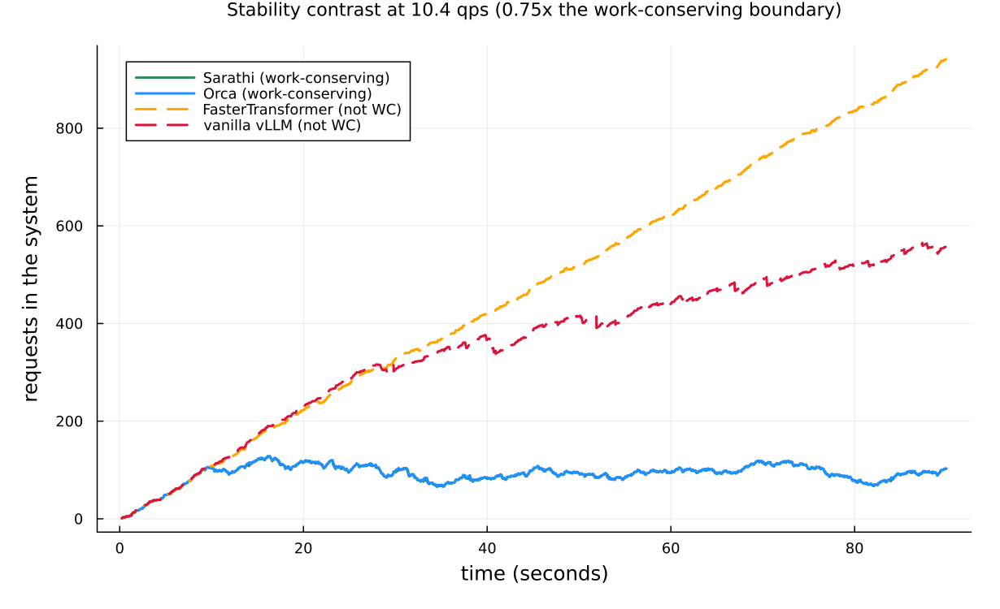
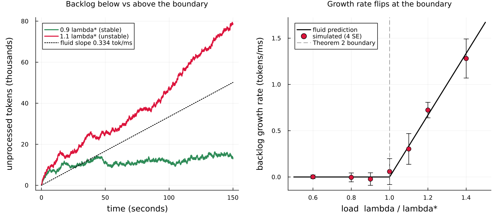
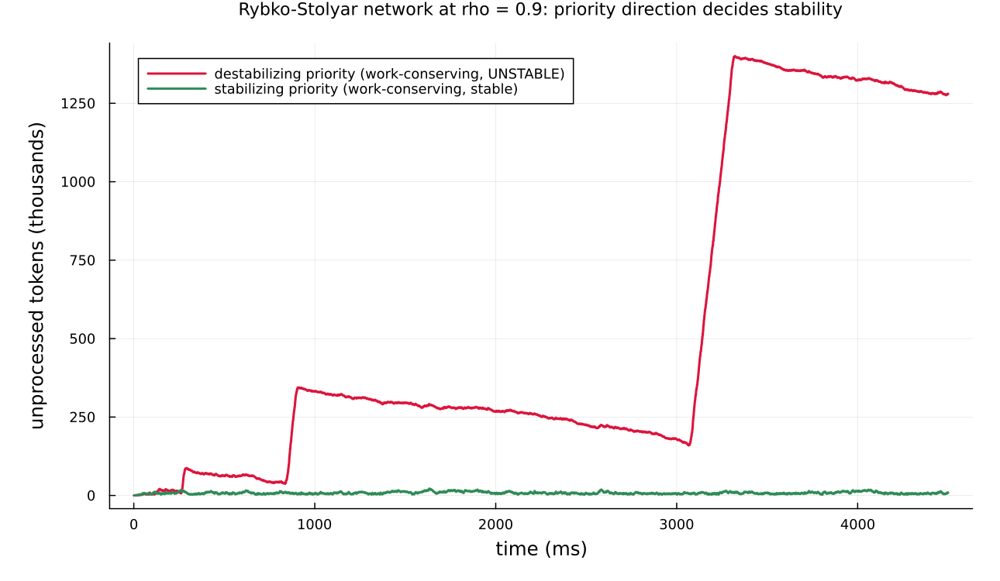

# Throughput-optimal scheduling for LLM inference

This page walks through `examples/dai2026_llm_scheduling.jl`: a reproduction
of the central stability results of Dai, Deng, Li & Peng,
"Throughput-Optimal Scheduling Algorithms for LLM Inference and AI Agents"
(arXiv:2504.07347,
[arxiv.org/abs/2504.07347](https://arxiv.org/abs/2504.07347)).

The paper asks a queueing question about *scheduling algorithms* for large
language model (LLM = large language model) inference: which ones keep the
server stable under load, and which ones fall over. It answers with a clean
principle — **work-conserving scheduling is throughput-optimal** — and shows
that two widely deployed algorithms violate it. This example reproduces that
contrast, the stability boundary that underlies it, and a networked
counter-example where even a work-conserving policy destabilizes.

The example builds directly on Concourse's round-based token service; read
[Round-based token service](rounds.md) first for the `Rounds` machinery and
the shipped policies. It is a companion to the
[M/G/1 LLM example](yang_llm_mg1.md), which models a *single-request-at-a-time*
server; here the server batches many requests per iteration.

## What the system does

An LLM answers a request in two phases. The **prefill** phase reads the whole
input prompt to build the model's **KV cache** (KV = key-value; the per-token
attention state the model reuses so it does not recompute earlier tokens).
The **decode** phase then generates the answer one token at a time, because
each new token depends on the previous one.

The server does not finish one request before starting the next. At every
**iteration** — one forward pass through the model on the graphics processing
unit (GPU) — the scheduler forms a **batch** of tokens drawn from many
requests at once: a chunk of prefill tokens from one request, a single decode
token from each of several others. It runs the batch through the GPU, and
every request in the batch has its remaining work reduced by exactly what it
was allocated. Requests stay resident across many iterations. Queueing theory
calls this **iteration-level batching**.

Two constraints shape the batch. The **token budget** `b_max` caps the total
number of tokens processed per iteration (hardware cannot process an unbounded
batch). The rule that decode contributes at most one token per request per
iteration is a hard consequence of autoregression — you cannot generate token
`k+1` before token `k` exists.

The intervention the paper studies is the **scheduling algorithm**: given the
waiting and in-progress requests, which tokens go in the next batch? Four real
algorithms, each shipped as a Concourse [`RoundPolicy`](@ref):

| Algorithm | Concourse policy | Priority | Mixed batching? | Work-conserving? |
|-----------|------------------|----------|-----------------|------------------|
| FasterTransformer | [`FasterTransformerRule`](@ref) | decode-first | no | **no** |
| vanilla vLLM | [`VanillaVLLM`](@ref) | prefill-first | no | **no** |
| Orca | [`Orca`](@ref) | prefill-first | yes | yes |
| Sarathi-Serve | [`Sarathi`](@ref) | decode-first | yes (chunked prefill) | yes |

A policy is **work-conserving** if it fills the batch to `b_max` whenever
there is enough waiting work to do so — it never leaves GPU capacity idle when
work is available. Mixed batching (combining prefill and decode tokens in one
batch) is what lets a policy stay work-conserving: without it, an
all-decode batch with only a few active requests wastes most of the budget.

## Why this maps to Concourse round service

Concourse expresses iteration-level batching with the `rounds` keyword of
[`station!`](@ref). A round station has one station-level clock per round,
per-job integer work counters, and a policy hook consulted at every round
boundary. That is exactly the paper's model: the clock is the forward-pass
timer, the counters are the unprocessed `(prefill, decode)` token counts, and
the policy is the scheduling algorithm. Nothing else changes — arrivals,
routing, and records keep their usual meaning.

```julia
station!(net, :gpu;
    rounds = Rounds(policy   = Sarathi(budget = 512),
                    duration = dai_staircase(),
                    work     = (:v_p, :v_d)))
```

The `work` marks `(:v_p, :v_d)` are the prefill and decode token counts, in
phase order; they are snapshotted into integer counters when a request is
admitted. The last phase (`:v_d`) is decode; earlier phases are chunkable
prefill.

### The batch-processing-time model

How long does one forward pass take? The paper's key empirical finding
(Sec. 2.3, Fig. 5-6) is that on real hardware the batch time depends almost
only on the **token load** `b` (the total tokens in the batch), not on which
requests contributed them, and follows a **staircase**:

    t_b = c + a * ceil(b / b_0)   milliseconds.

The cost jumps every `b_0` tokens (`b_0` is the hardware block size). For
CodeLlama-34B on one A100 80GB GPU at tensor-parallel size 1, the paper fits
`c = 11.28 ms`, `a = 35.47 ms`, `b_0 = 128` tokens, with R² above 0.97. All
times in this example are in **milliseconds**.

In Concourse the duration is a `Dirac` (deterministic) law that reads the
round's total token allocation through the frozen pseudo-mark `:tokens`:

```julia
dai_staircase() = Law(:Dirac;
    value = Const(11.28) + Const(35.47) * ceil(Mark(:tokens) / Const(128.0)))
```

The `ceil` is flat between its jumps, so this is a genuine step function of
the batch size — the staircase the paper measured, not a smooth approximation.

**What is calibrated vs published.** The three staircase constants
`(c, a, b_0)` are the *only* numbers this example takes from a fit, and they
are printed verbatim in the paper. Every other quantity — workloads, arrival
rates, token budgets, priorities — is taken directly from the paper's stated
experiments. See the honest caveat on Figure 1 below.

## The headline: Theorem 2

The maximal rate at which the GPU can process tokens is `b_max / t_{b_max}`:
fill the budget every round. For `b_max = 512`, `t_512 = 11.28 + 35.47·4 =
153.16 ms`, so the ceiling is `512 / 153.16 = 3.343` tokens per millisecond.

Requests arrive as a Poisson process of rate `λ`, each carrying on average
`m_p + m_d` tokens of work. **Theorem 2** states the stability boundary:

    λ (m_p + m_d)  <  b_max / t_{b_max}     ⇒  stable under any work-conserving policy
    λ (m_p + m_d)  >  b_max / t_{b_max}     ⇒  unstable under any policy

Below the line, a work-conserving server keeps the backlog bounded; above it,
no algorithm can keep up and the backlog diverges. Crucially, a
*non*-work-conserving policy wastes capacity, so it can diverge well *below*
this line.

## Experiment 1: the stability contrast



This is the paper's Figure 1 in spirit: total requests in the system over
time, all four policies, at one fixed arrival rate. The model builder is the
plain round station under each policy:

```julia
function gpu_model(policy; vp, vd)
    net = QueueNetwork(param_names = (:lambda,))
    source!(net, :arrive;
        interarrival = Law(:Exponential, scale = inv(Param(:lambda))),
        mark = MarkLaw(v_p = Law(:Dirac, value = Const(vp)),
                       v_d = Law(:Dirac, value = Const(vd))))
    station!(net, :gpu;
        rounds = Rounds(policy = policy, duration = dai_staircase(), work = (:v_p, :v_d)))
    sink!(net, :done)
    route!(net, :arrive, Always(:gpu))
    route!(net, :gpu, Always(:done))
    compile(net)
end
```

The workload is the paper's Fig. 1 setup: mean **129 prefill + 112 decode**
tokens per request (`m_p + m_d = 241`). The two work-conserving policies,
**Sarathi and Orca, stay flat** at about 100 requests in the system. The two
non-work-conserving policies ramp up and away: **FasterTransformer reaches 941
and vanilla vLLM 557** by 90 seconds, still climbing. Same arrivals, same GPU,
same batch-time model — only the scheduling algorithm differs.

The trajectory is read straight off the replayed record: `replay(m, rec)`
returns the state after every firing, and `number_in_system(st)` counts the
requests in it. No counter is bolted into the simulator.

**An honest caveat — why 10.4 qps and not 14 qps.** The paper's Figure 1 left
panel is an *empirical* A100 latency trace at 14 queries per second (qps),
whose batch times are *measured on real hardware*. This example instead drives
the batch clock with the *fitted* staircase. With the fitted constants, the
work-conserving stability boundary for the 129/112 workload sits at
`3.343 / 241 = 0.01387` req/ms ≈ **13.9 qps** — so the paper's 14 qps is
essentially the critical point, where even a work-conserving server is only
marginally stable. To get a clean bounded-vs-diverging contrast from the
*model*, the example draws the picture at **0.75 of the boundary (≈ 10.4
qps)**. We reproduce the model and its stability structure, not the hardware
trace. This is the one place where the fitted staircase and the measured
latency diverge, and it is called out in the script header as well.

## Experiment 2: the Theorem 2 boundary



This experiment tests Theorem 2 quantitatively. The workload is the paper's
`(v_p, v_d) = (100, 100)` (so `m_p + m_d = 200`), which puts the boundary at

    λ* = (b_max / t_{b_max}) / (m_p + m_d) = 3.343 / 200 = 0.016715 req/ms ≈ 16.71 qps.

The **left panel** shows two backlog trajectories: at `0.9 λ*` the total
unprocessed tokens stay bounded (green), and at `1.1 λ*` they grow linearly
(red). The fluid limit predicts the growth *rate* above the boundary exactly:

    slope = λ (m_p + m_d) − b_max / t_{b_max}     tokens per ms.

The dotted line is that prediction for the `1.1 λ*` run.

The **right panel** sweeps the load from `0.6 λ*` to `1.4 λ*` and plots the
measured second-half backlog growth rate against the fluid curve
`max(0, λ(m_p+m_d) − b_max/t_{b_max})`. The measured slopes sit on the
prediction and flip from zero to positive exactly at the boundary
`λ/λ* = 1` — the kink is Theorem 2.

This is also the **stochastic half of the validation table** (below): the
growth rate is a genuine closed-form oracle, and the simulation matches it at
four standard errors.

## Experiment 3: the Rybko-Stolyar AI-agent network



The paper's Section 5.4 delivers a warning: work-conserving scheduling is
throughput-optimal for a single server and for feed-forward (DAG = directed
acyclic graph) networks, **but not when the routing has a cycle**. It builds a
two-server example, inspired by the classical Rybko-Stolyar network, where a
work-conserving policy *destabilizes* the network even though each server is
under-loaded.

The setup models two collaborating AI-agent servers. **Type A** requests do a
*short* task at server 1 then a *long* task at server 2; **Type B** requests
flow the reverse way (short at server 2, long at server 1). Because the two
types route in opposite directions, the server-level routing graph has a
cycle. In Concourse this is a two-station network with a per-hop
[`remark`](../queues/marks.md#Redrawing-marks-en-route) that redraws each hop's
`(v_p, v_d)` token sizes on deposit, so the long prefill lands on each type's
*second* hop:

```julia
station!(net, :s1;
    remark = (v_p = Law(:Poisson, lambda = Const(-448.0) + Const(480.0) * Mark(:class)),
              v_d = Law(:Poisson, lambda = Const(32.0))),
    rounds = Rounds(policy   = ClassPriority(Sarathi(budget = 768); by = :class, order = o1),
                    duration = Law(:Dirac, value = Const(1.0)),
                    work     = (:v_p, :v_d)))
```

Both servers run the *same* work-conserving mixed policy (Sarathi), wrapped in
[`ClassPriority`](@ref) — strict non-preemptive priority by request class. The
only thing that changes between the two runs is the **direction** of that
priority:

- **Destabilizing:** each server prioritizes the class *exiting* through it
  (server 1 favors type B, server 2 favors type A). The total token backlog
  **grows without bound**, in the geometrically growing oscillations
  characteristic of the Rybko-Stolyar instability — the peaks roughly
  quadruple each cycle (≈ 85k → 340k → 1.4M tokens in the figure).
- **Stabilizing:** reverse the priority. The backlog stays **bounded** near
  22k tokens for the whole run.

In the example the destabilizing peak (**1,400,284 tokens**) is **63×** the
stabilizing peak (**22,168 tokens**). Both configurations are work-conserving
and both servers are individually at load `ρ = 0.9`; only the priority
direction decides stability. The lesson from the paper: with cyclic routing,
work-conserving alone is not enough — the priority must be chosen with care
(and DAG routing avoids the trap entirely).

## Validation

The script prints a validation table with two parts.

**Part 1 — Fig. 8 batch compositions (deterministic, exact match).** Paper
Figure 8 is a five-request worked example: requests A, B, C are already
decoding with decode lengths 2, 4, 3, and D, E (one prefill + one decode token
each) arrive during the first round. The example replays each policy's
committed round plans and checks the batch-by-batch token compositions against
the figure, character for character:

```
== validation 1: Fig. 8 batch compositions (deterministic, exact match) ==
VLLM    PASS  (5 batches)
ORCA    PASS  (4 batches)
FT      PASS  (6 batches)
SARATHI PASS  (4 batches)
```

The figure fixes only the decode lengths and is schematic about its token
budget: `b_max = 4` reproduces the vLLM, FasterTransformer, and Sarathi rows
exactly, and `b_max = 5` the Orca row (no single budget fits all four — Orca's
second batch carries five tokens where vLLM's third stops at four). These
constants are inherited verbatim from the repository's paper-reproduction
tests.

**Part 2 — Theorem 2 boundary slope (stochastic, 4 SE).** The backlog growth
rate is compared to the fluid oracle at three loads, over six replicates each
at a 120-second horizon:

```
== validation 2: Theorem 2 boundary slope vs fluid oracle (stochastic, 4 SE) ==
  lambda* = 0.016715 req/ms  (16.71 req/s);  b_max/t_bmax = 3.3429 tokens/ms
lambda/lambda*  measured slope          fluid oracle    |z|
0.9             0.0078 ± 0.0143         0.0             0.55
1.1             0.3383 ± 0.0464         0.3343          0.09
1.2             0.6683 ± 0.0362         0.6686          0.01
```

All three pass at four standard errors (largest `|z| = 0.55`): below the
boundary the slope is statistically zero, and above it the simulated growth
rate matches the fluid prediction to within noise.

## What this demonstrates about Concourse

- **Real scheduling algorithms drop in as policies.** Four production LLM
  schedulers — FasterTransformer, vanilla vLLM, Orca, Sarathi-Serve — are the
  shipped `RoundPolicy` objects, swapped by changing one argument. The
  work-conserving / not-work-conserving distinction that decides stability is
  purely a property of the policy, and the model exposes it directly.
- **A measured hardware curve is one `Dirac` law.** The staircase batch-time
  model `t_b = c + a·ceil(b/b_0)` is a deterministic duration reading the
  round's frozen token aggregate; the `ceil` is flat between jumps, so it is
  the exact step function, not an approximation.
- **Networked, multi-class, cyclic routing composes.** The Rybko-Stolyar
  example combines round service, per-hop mark redraws, class priority, and a
  routing cycle — and reproduces a subtle instability phenomenon with no new
  machinery.
- **The oracles are read off the replayed record.** Backlog, requests in
  system, and committed batch compositions all come from folding over
  `replay(m, rec)` states; the fluid growth rate is a closed-form check the
  simulation matches at four standard errors.

## Caveats and exclusions

- **Fitted staircase, not measured latency.** As detailed under Experiment 1,
  the batch clock uses the paper's fitted CodeLlama-34B TP-1 staircase, not
  the empirical A100 trace of Figure 1. The stability contrast is therefore
  drawn at 0.75 of the fitted boundary (≈ 10.4 qps) rather than the paper's
  14 qps.
- **Deterministic token sizes.** Requests carry their mean `(m_p, m_d)` as
  fixed marks, matching the paper's stability experiments (Theorem 2 depends
  only on the means). The single-request [M/G/1 example](yang_llm_mg1.md)
  models the heavy-tailed length distribution instead.
- **No gradient showcase.** The staircase and round durations are `Dirac`
  laws, which bear no score channel, and round dynamics are not certified for
  pathwise IPA (a perturbation can reorder a deposit against a round
  boundary). Differentiation is out of scope here; see the estimator-validity
  discussion in [Round-based token service](rounds.md#Estimators).
- **Batch-size constraint (`k_max`) and vertex-C.** The paper's Section 6
  two-dimensional stability region (where even work-conserving Sarathi can
  fail at a specific operating point) is reproduced in the repository's test
  suite (`test/test_rounds_papers.jl`) but left out of this example to keep
  the narrative focused on the headline stability results.

## Running it

```
julia --project=examples examples/dai2026_llm_scheduling.jl
```

Runtime is about one minute (cold start included). The figures land in
`docs/figures/` and `docs/src/manual/figures/`. The docs build does **not**
run the simulation — the committed PNGs are the artifacts this page embeds.
