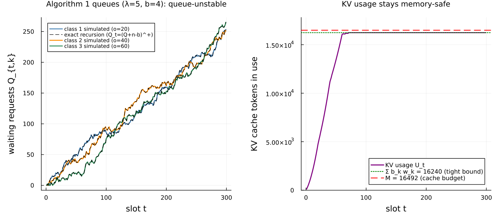
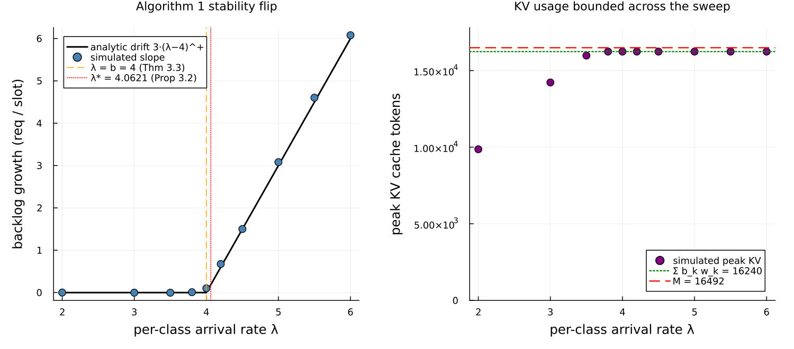
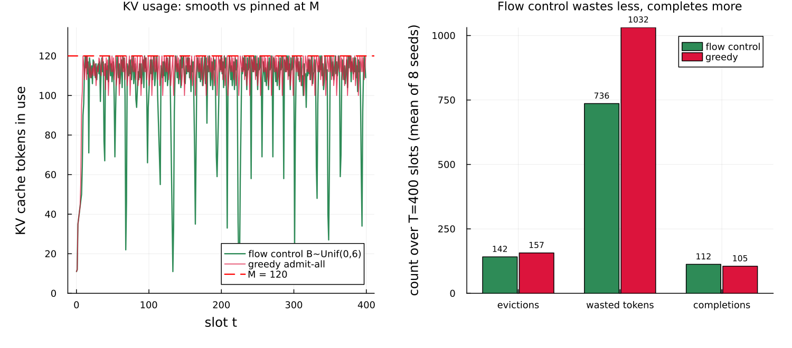

# Flow-controlled LLM inference as a round station

This page walks through `examples/dong2026_flow_control.jl`: a model of an
LLM inference server whose scarce resource is GPU memory, built on
Concourse's [round-based token service](rounds.md) and used to reproduce
the synthetic experiment of Dong & Cao, "Flow-Controlled Scheduling for
LLM Inference with Provable Stability Guarantees" (arXiv:2604.11001,
[arxiv.org/abs/2604.11001](https://arxiv.org/abs/2604.11001)).

This paper is a **preprint** — it has not yet been peer reviewed — so treat
its numbers as the authors' reported values, not settled results. Two of
its policies ship with Concourse as [`ClassBudgets`](@ref) (the paper's
Algorithm 1) and [`FlowControl`](@ref) (Algorithm 2), and the Concourse
test suite already reproduces the paper's core identities. This example
turns those into a runnable, figure-producing walkthrough.

## Some vocabulary first

A few terms are needed before the model makes sense.

- **LLM** = large language model: a program that generates text one word-piece
  (**token**) at a time.
- **GPU** = graphics processing unit: the specialized processor that runs the
  model. Its memory is limited and expensive.
- **KV cache** = key–value cache. To generate each new token, the model needs
  the "key" and "value" vectors it already computed for every earlier token in
  the request. Rather than recompute them every step, the server stores them in
  GPU memory — the KV cache. This store grows by one entry for every token a
  request has processed and is freed only when the request finishes. So a
  request that arrived with a prompt of `l` tokens and has since generated `j`
  output tokens occupies `l + j` cache entries. The sum over all in-flight
  requests must stay under a hard budget `M` (the GPU memory set aside for the
  cache). If it would overflow, the server must **evict** a request — discard
  its cached work — which wastes everything that request had computed.
- **Prefill** and **decode**: serving a request has two phases. Prefill reads
  the whole prompt (all `l` input tokens) in one shot; decode then generates
  output tokens one at a time. Both consume cache; the paper's timing model
  charges time only to decode.

The central tension: to use the GPU well the server processes many requests at
once (batching), but every active request holds growing cache, so admitting too
many at once can overflow memory and force wasteful evictions.

## The paper's model

The paper discretizes time into **slots**, one slot per decode iteration. It
tracks each request by a triple `(l, o, t)`: prompt length `l`, output length
`o` (how many tokens it will generate), and arrival slot `t`. Each slot:

1. New requests arrive and join a **waiting queue** — they hold no cache yet.
2. The scheduler **activates** some waiting requests, moving them into the
   **active set**; each activated request begins holding cache.
3. Every active request generates exactly one output token this slot. A request
   that reaches its `o`-th token completes and frees all its cache at the end of
   the slot.
4. At all times the total cache usage `U = Σ (l + j)` over active requests must
   stay `≤ M`.

The one idea of the paper is **flow control**: cap how many requests may be
activated per slot. Admitting requests smoothly instead of in bursts keeps `U`
from spiking, which keeps the system away from overflow.

Two settings, two algorithms:

- **Algorithm 1 (known output length).** Requests fall into `m` classes by
  their `(l, o)`. Each slot, for each class `k`, activate up to `b_k` waiting
  requests (first come first served). Because the per-slot admission per class
  is capped at `b_k`, the active memory is bounded and — if the budgets satisfy
  the paper's inequality — the cache never overflows and no eviction ever
  happens.
- **Algorithm 2 (unknown output length).** Output length is not known at
  arrival, so the scheduler cannot classify. Each slot it draws a single global
  activation budget `B_t`, activates up to `B_t` waiting requests, and then, if
  memory still overflows, **evicts** active requests **LIFO** (last in, first
  out — the most recently activated first) with full progress reset, until
  `U ≤ M`. Evicted requests return to the queue and must regenerate everything
  when re-admitted.

## Why this is a round station

Concourse's [`Rounds`](@ref) capability is exactly this iteration-level
batching: one station-level clock per slot, per-job integer work counters, and
a policy hook at each slot boundary that reads the waiting line and active set
and returns admissions, evictions, and per-job token allocations. The paper's
token model is the simplest timing case:

- **duration** is a `Dirac` at `1.0` — every slot lasts one time unit,
  regardless of batch composition (prefill costs memory but, in this model, no
  time);
- there is **one work phase**, the output-token count `o`, snapshotted into a
  counter at activation and decremented by one each slot the request is active;
- the prompt length `l` is an ordinary **mark** — it costs cache but is never
  "worked off."

The two shipped policies are the two algorithms verbatim. Algorithm 1 is
[`ClassBudgets`](@ref)`(b; class)`; Algorithm 2 is
[`FlowControl`](@ref)`(Bdist, M; prompt)`, which draws its budget through the
round's draw source (so it replays deterministically) and does the KV
accounting and LIFO eviction internally.

Here is the three-class model of the paper's synthetic experiment:

```julia
function dong_three_class(; b = (4, 4, 4))
    net = QueueNetwork(param_names = (:lambda,))
    for (k, (l, o)) in enumerate(((10, 20), (10, 40), (10, 60)))
        source!(net, Symbol(:arrive, k);
                interarrival = Law(:Exponential, scale = inv(Param(:lambda))),
                mark = MarkLaw(class = Law(:Dirac, value = Const(Float64(k))),
                               l = Law(:Dirac, value = Const(Float64(l))),
                               o = Law(:Dirac, value = Const(Float64(o)))))
        route!(net, Symbol(:arrive, k), Always(:gpu))
    end
    station!(net, :gpu;
             rounds = Rounds(policy = ClassBudgets(b; class = :class),
                             duration = Law(:Dirac, value = Const(1.0)),
                             work = (:o,)))
    sink!(net, :done)
    route!(net, :gpu, Always(:done))
    compile(net)
end
```

Each of the three classes is its own Poisson source stamping the marks
`class`, `l`, and `o`; they all feed one round station under `ClassBudgets`.

## The workload numbers

The paper's synthetic classes are `(l, o) = (10, 20), (10, 40), (10, 60)`, each
arriving as an independent Poisson stream of rate `λ = 5` per slot, with cache
budget `M = 16492` (their stated scale for Llama2-70B on two A100 GPUs) and
activation budgets `b = (4, 4, 4)`.

The **minimum KV workload** of one class-`k` request is the total cache-entry-
slots it must consume to finish:

```math
w_k = \sum_{j=1}^{o^{(k)}} (l^{(k)} + j) = l^{(k)} o^{(k)} + \tfrac12\!\left(o^{(k)} + (o^{(k)})^2\right).
```

For the three classes this is `w = (410, 1220, 2430)`. Two inequalities from
the paper use these weights, and the example checks both:

- **Proposition 3.2 (necessary condition for stability).** No scheduler of any
  kind can keep the system stable if `Σ λ_k w_k > M`. With `Σ w_k = 4060`, the
  boundary is `λ* = M / Σ w_k = 16492 / 4060 = 4.0621`.
- **Theorem 3.3 (Algorithm 1 is sufficient for stability).** Algorithm 1 keeps
  both the cache safe and the queues stable when `Σ b_k w_k < M` **and**
  `b_k > λ_k`. The first part is `Σ b_k w_k = 16240 < 16492` — the cache bound,
  tight. The second part, `b_k > λ_k`, needs `λ < 4` for integer budgets
  `b = 4`.

Notice the tension at the paper's own `λ = 5`: the cache bound holds
(`16240 < 16492`, so memory is safe), but `b = 4 < λ = 5`, so Theorem 3.3 does
**not** apply and the waiting queues are unstable — latency grows without bound.
That is deliberate. The synthetic experiment lives in a regime where
`Σ λ_k w_k = 20300 > M`, so by Proposition 3.2 *no* algorithm can be
queue-stable; the whole point is that flow control still keeps **memory** smooth
and predictable while greedy admission thrashes on evictions. The example makes
both facts visible: the queue grows, and the cache never overflows.

## The oracles

Two closed forms drive the validation.

**The exact decoupling recursion (Algorithm 1).** Because Algorithm 1 has no
memory check, the classes never interact: each class's waiting queue follows the
scalar recursion

```math
Q_{t,k} = (Q_{t-1,k} + n_{t,k} - b_k)^+,
```

where `n_{t,k}` is the number of class-`k` arrivals in slot `t`. Given the
recorded arrival times this is a deterministic sequence, and the simulated
per-class queue must match it **slot for slot** — an exact identity, not a
statistical one.

**The stationary mean queue (stable regime).** When `λ < b`, the recursion is a
positive-recurrent reflected random walk (Poisson increments, deterministic
drain `b`). Its stationary distribution — and hence `E[Q]` — is computed by
power-iterating the transition matrix on a truncated state space. The example
compares the simulated time-average queue to this `E[Q]` at four standard
errors, in the stable regime `λ = 3`.

## Validation

Running the script prints a table. The deterministic rows are checked exactly;
the stochastic rows are checked at four standard errors (`|z| ≤ 4`) using
batch means from one long run:

```text
check                                         simulated             target      verdict
Alg 1 decoupling identity (129 slots)         matches recursion     exact       PASS
Alg 1 peak KV usage (tokens)                  16240                 16240       PASS
  Σ b_k w_k = 16240 < M = 16492 ?             16240 < 16492         yes         PASS
Prop 3.2 boundary λ* = M / Σ w_k              4.0621                4.0621      PASS
Alg 1 stable E[Q] class 1 (λ=3, 4 SE)         0.773 ± 0.038         0.801       PASS (|z|=0.74)
Alg 1 stable E[Q] class 2 (λ=3, 4 SE)         0.793 ± 0.042         0.801       PASS (|z|=0.19)
Alg 1 stable E[Q] class 3 (λ=3, 4 SE)         0.814 ± 0.040         0.801       PASS (|z|=0.33)
Alg 1 token throughput (λ=3, 4 SE)            360.25 ± 1.76         360.0       PASS (|z|=0.14)
Alg 2 KV usage never exceeds M=120            max U = 120           ≤ 120       PASS
Alg 2 evictions actually exercised            143 evictions         > 0         PASS
```

The exact rows are the strongest: the simulated per-class queue reproduces the
scalar recursion at every one of the ~129 slots, and the peak cache usage is
**exactly** 16240, the paper's inequality-(2) bound hit tight by the saturated
budgets. (Your printed numbers for the stochastic rows will vary slightly with
seed but pass the same `|z| ≤ 4` test.)

## Figure 1: the synthetic experiment at λ = 5



The left panel plots the three per-class waiting queues over the first 300
slots at the paper's `λ = 5`. The simulated queues (solid) sit exactly on the
scalar recursion (dashed black) and grow roughly linearly: with `b = 4 < λ = 5`,
each class accumulates about one extra waiting request per slot. This is the
queue-unstable regime Proposition 3.2 predicts.

The right panel plots the KV cache usage `U_t` over the same run. It stays
**flat**, capped by the tight bound `Σ b_k w_k = 16240` (green dotted) and
comfortably under the budget `M = 16492` (red dashed). This is the paper's
point in one picture: even though the queue is unstable, memory is perfectly
safe — Algorithm 1 never overflows the cache, so it never wastes work on
eviction. The instability is in latency, not in memory.

## Figure 2: the stability flip



The left panel sweeps the per-class arrival rate `λ` and measures the backlog
growth rate — how fast the total waiting count rises, in requests per slot. It
is essentially zero below `λ = 4` and then climbs linearly, tracking the
analytic drift `3·(λ − 4)^+` (three classes, each with per-slot drift `λ − b`).
Two boundaries are marked: `λ = b = 4`, Algorithm 1's own sufficient condition
(Theorem 3.3), and `λ* = 4.0621`, the necessary condition for *any* scheduler
(Proposition 3.2). The gap between them is real: with integer budgets you cannot
raise `b` to 5 without violating the cache bound (`5 × 4060 = 20300 > M`), so
between `λ = 4` and `λ* = 4.0621` there is no admissible Algorithm-1 budget that
keeps the queue stable.

The right panel shows the peak KV usage across the same sweep. It never exceeds
the tight bound 16240, no matter how unstable the queue becomes — the cache
safety is structural, independent of load.

## Figure 3: what flow control buys (Algorithm 2)



Now the output length is unknown, so the scheduler runs Algorithm 2:
[`FlowControl`](@ref). One class of requests `(l, o) = (10, 15)` arrives at
`λ = 1` into a small cache `M = 120`, which overloads it. We compare two
activation budgets:

- **flow control**: a drawn budget `B_t ~ DiscreteUniform(0, 6)`, mean 3 — the
  paper's smooth admission;
- **greedy admit-all**: a large constant budget, which admits everything
  waiting each slot. This is the paper's own remark that "when `b` is large, the
  algorithm degenerates to a greedy algorithm with a LIFO eviction rule."

The left panel plots the cache trajectory. Flow control varies smoothly below
`M`; greedy pins the cache at `M` and evicts on almost every slot. The right
panel totals the cost over the run (averaged over eight seeds): greedy triggers
more evictions, wastes far more tokens to progress-resets (work it computed and
then threw away), and — because of that waste — completes **fewer** requests.
Controlling the activation rate buys smoother memory and less wasted
computation, which is exactly the paper's thesis.

Note this compares against a single greedy baseline, not the paper's full
benchmark suite (`α`-protection, MC, MC-SF, Amin) or its Gurobi hindsight-
optimal solutions. Those need separate implementations and an integer-program
solver, and are out of scope here.

## Honest caveats

- **This is a preprint.** The results above reproduce the paper's synthetic
  Section 4.1 setup and its two proven inequalities, but the paper itself has
  not been peer reviewed.
- **The real-trace experiment (Section 4.2) is excluded.** There the paper
  replaces the one-slot `Dirac` timing with Microsoft Vidur, an external
  LLM-serving simulator that computes each batch's wall-clock time from its
  exact prefill/decode composition. There is no published closed form for that
  timing, so it cannot serve as an oracle; the synthetic experiment is the
  reproduction target.
- **The published constants are used as-is.** Unlike the calibrated service
  line in the [M/G/1 example](yang_llm_mg1.md), every number here — the class
  lengths, `λ`, `M`, and `b` — is taken directly from the paper's Section 4.1.
  The only derived constant, `Σ b_k w_k = 16240`, is recomputed in the script so
  it is auditable.
- **`λ = 5` is queue-unstable by design.** The synthetic experiment is a
  finite-horizon overload study, not a stable steady state. The stochastic
  validation rows therefore use a separate stable point (`λ = 3`), where a
  stationary distribution actually exists.

## What this demonstrates about Concourse

- **Round policies are the paper's algorithms.** Both `ClassBudgets` and
  `FlowControl` are a few dozen lines over the [`RoundView`](@ref), and they
  reproduce the paper's exact decoupling identity and eviction dynamics without
  any special-casing in the engine.
- **The token-level model is just a round station with a unit `Dirac`
  duration.** Discrete-time slots, one token per active request per slot, and
  prefill-as-a-mark all fall out of the general round lifecycle.
- **Exact structural identities are checkable from the record.** The decoupling
  recursion, the tight 16240 cache bound, and Algorithm 2's full-recomputation
  accounting are all read back by folding over the recorded firings — the record
  carries everything, including the `FlowControl` budget draws.

## Running it

```text
julia --project=examples examples/dong2026_flow_control.jl
```

It prints the validation table and writes three figures to both
`docs/figures/` and `docs/src/manual/figures/`. Total runtime is a few minutes.
