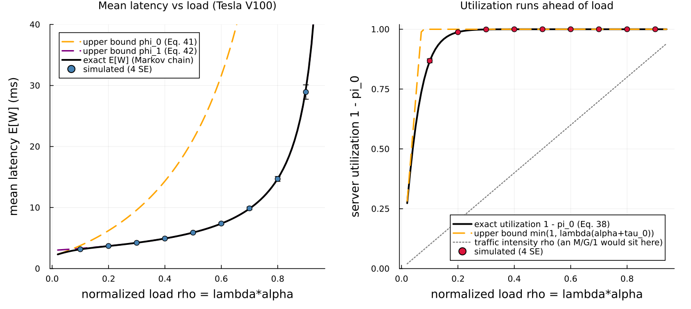
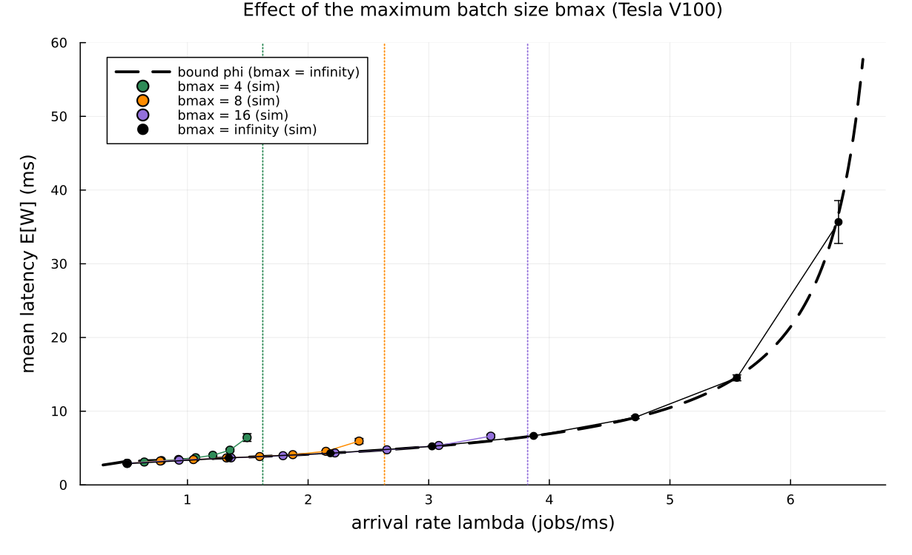

# A batch-service model of a GPU inference server with dynamic batching

This page walks through `examples/inoue2021_dynamic_batching.jl`: a single-GPU
inference server that gathers waiting requests into batches, modeled with
Concourse's [`Batching`](@ref) capability, checked against two exact closed-form
oracles, and used to reproduce the mean-latency figures of Inoue, "Queueing
analysis of GPU-based inference servers with dynamic batching" (Performance
Evaluation 2021, arXiv:1912.06322,
[arxiv.org/abs/1912.06322](https://arxiv.org/abs/1912.06322)).

GPU = graphics processing unit. FCFS = first come, first served. SE = standard
error.

The paper's Section 3.2 result on *energy efficiency* (that efficiency rises
monotonically with load) is out of scope here; this example reproduces the
latency analysis of Sections 2 and 3.3 and the finite-batch experiment of
Section 4.

## What the server does

A GPU answers an inference request — classify this image, transcribe this
clip — by running a fixed neural network over the input. The important fact is
that a GPU is a *wide parallel processor*: it can run the same network over
many inputs at once for almost the same wall-clock cost as running it over one
input. The fixed cost of launching the computation — moving the network's
weights on-chip and starting thousands of parallel threads — is paid once,
whether the batch holds one request or a hundred.

The paper's Table 1 measures this directly on a Tesla V100. A batch of 1 image
is processed at 476 images/second; a batch of 128 at 6275 images/second. So a
batch of 128 takes only about 13 times the wall-clock time of a single image,
not 128 times. **This is why GPUs batch:** waiting a moment to gather the
requests that have piled up, and processing them together, is far more
efficient than serving them one at a time.

Formally the batch processing time is *affine in the batch size* (the paper's
Assumption 4):

    tau(b) = alpha * b + tau_0        (milliseconds),

where `tau_0` is the fixed per-batch launch overhead and `alpha` the marginal
cost of one extra request in the batch. It is *deterministic* because a neural
network applies the same fixed sequence of operations to a fixed-shape input
regardless of the data — so the time depends only on the batch size `b`, not on
which images are in the batch.

## The dynamic batching rule

The scheduling policy the paper analyzes is deliberately simple: **whenever the
server becomes idle and at least one request is waiting, it gathers *all*
waiting requests into a single batch and starts processing immediately.** There
is no fixed batch size and no timer — the batch is exactly whatever accumulated
while the previous batch was being processed.

This creates a natural feedback. Under heavy load a large batch is running,
more requests pile up behind it, and the next batch is large (and processed
efficiently). Under light load batches are small, often size 1. A size-1 batch
is the *least* efficient mode — full overhead `tau_0` for a single request — so
the system dislikes being lightly loaded, a point that returns below.

## Why this is a batch-service queue in Concourse

This gather-everything-on-idle rule is exactly [`Batching`](@ref)`(min = 1,
max = typemax(Int))`, the default in Concourse: while a server slot is free and
at least one job waits, take the entire line into one batch. When a batch
forms, Concourse mints one synthetic job carrying a single mark,
`batchsize = b`, and the batch's service clock reads that mark. So the affine
processing law is one line — no new expression atom — and on completion the `b`
members route out individually. The mechanics are documented in
[Batch service](batching.md).

## The Concourse model

One Poisson source (the "arrivals"), one FCFS station whose deterministic
service law reads the batch-size mark, and gather-everything batching:

```julia
function inoue_model(; α = ALPHA, τ0 = TAU0, bmax = typemax(Int))
    net = QueueNetwork(param_names = (:lambda,))
    source!(net, :arrive;
            interarrival = Law(:Exponential, scale = inv(Param(:lambda))))
    station!(net, :gpu;
             service = Law(:Dirac, value = Const(τ0) + Const(α) * Mark(:batchsize)),
             batching = Batching(min = 1, max = bmax))
    sink!(net, :done)
    route!(net, :arrive, Always(:gpu))
    route!(net, :gpu, Always(:done))
    compile(net)
end
```

`bmax = typemax(Int)` is the paper's infinite-maximum-batch-size model; a finite
`bmax` caps the sweep at `bmax` jobs, the finite variant of Section 4.

### The published service line

The constants are

    alpha = 0.1438 ms/job,   tau_0 = 1.8874 ms.

**These are published, not calibrated by us.** They are the paper's own
least-squares fit to the Tesla V100 (mixed precision) row of Table 1, reported
in Section 3.3 just after Assumption 4, with coefficient of determination
R² ≈ 0.9998. All times are in milliseconds, exactly as the paper plots them.
The arrival rate `lambda` is in jobs/ms; the *normalized load* is
`rho = lambda * alpha`, and the stability condition is `rho < 1` (the paper's
Eq. 27). The paper also reports a Tesla P4 (INT8) fit `alpha = 0.5833`,
`tau_0 = 1.4284`; we use only the V100 fit.

## Two exact oracles

For this model the mean latency is exact in closed form two different ways, and
the example computes both — one to validate the simulator, one to reproduce the
paper's headline bound.

**The exact latency.** The sequence of processed batch sizes `B_1, B_2, …` is a
Markov chain: the next batch is exactly the number of arrivals during the
current batch's processing time, `B_{n+1} = A_n + 1{A_n = 0}`, where
`A_n | B_n = b` is Poisson with mean `lambda * (alpha*b + tau_0)` (the paper's
Eqs. 3–5). We truncate that chain, solve for its stationary distribution by
linear algebra, read off `E[B]` and `E[B²]`, and apply the paper's Eq. 36:

```julia
function exact_latency(λ, α, τ0; B = 600)
    EB, EB2 = batch_moments(λ, α, τ0; B)
    α + τ0 + (1 + 2 * λ * α) * (EB2 - EB) / (2 * λ * EB)
end
```

This oracle touches nothing in the simulator — only Poisson probabilities and a
linear solve.

**The closed-form bound.** The paper's main result, Theorem 2, is a pair of
*upper* bounds on the mean latency that need no chain solve at all:

```julia
φ0(λ, α, τ0) = (α + τ0) / (2 * (1 - λ * α)) * (1 + 2 * λ * τ0 + (1 - λ * τ0) / (1 + λ * α))
φ1(λ, α, τ0) = 1.5 * τ0 / (1 - λ * α) + (α / 2) * (λ * α + 2) / (1 - λ^2 * α^2)
φ(λ, α, τ0)  = min(φ0(λ, α, τ0), φ1(λ, α, τ0))
```

`phi_0` (Eq. 41) is obtained by pretending the mean batch size is its trivial
lower bound `E[B] = 1`, and is tight only at *low* load. `phi_1` (Eq. 42) is
obtained by pretending the idle probability `pi_0 = 0`, and is tight from
moderate load upward. Their minimum `phi` is the paper's simple, remarkably
accurate approximation to the exact `E[W]`.

## Validation: the simulation against the exact oracle

The simulated mean latency is measured by Little's law — `E[W] = E[L] / lambda`,
the paper's own Lemma 2 identity — where `E[L]` is the time-average number of
requests in the system (which counts batch *members*, not the synthetic batch
job). Sixteen replications of 6000 simulated milliseconds each. At every load
the simulated mean latency agrees with the exact Markov-chain oracle within the
repository's four-standard-error convention, and lies under the bound:

```
Tesla V100 fit: alpha = 0.1438 ms, tau_0 = 1.8874 ms, infinite bmax
rho   lambda   simulated W (ms)        exact W (ms)  bound phi   |z|
0.3   2.086    4.212 ± 0.016           4.225         4.226       0.79
0.5   3.477    5.897 ± 0.022           5.902         5.902       0.21
0.7   4.868    9.759 ± 0.039           9.818         9.818       1.53
0.8   5.563    14.663 ± 0.123          14.715        14.715      0.42
0.9   6.259    29.281 ± 0.443          29.408        29.408      0.29
```

All five points pass at 4 SE (largest |z| = 1.53). Notice that the exact `E[W]`
and the closed-form bound `phi` are *identical to three digits* from
`rho = 0.5` up: this is the paper's central empirical claim — the simple bound
`phi_1` is not just an upper bound but an excellent approximation over most of
the load range.

## Experiment 1: mean latency and the utilization surprise



The left panel reproduces the paper's Figure 4: mean latency `E[W]` against the
normalized load `rho`, with simulated points (4-SE bars) on the exact curve.
The two dashed upper bounds are drawn too. `phi_0` (orange) hugs the exact curve
only near `rho = 0` and then shoots up; `phi_1` (purple) is so tight that it
disappears *underneath* the exact black curve for essentially the whole range —
which is precisely the paper's point about the accuracy of Theorem 2.

The right panel reproduces the paper's Figure 5 and is the more surprising
result. In an ordinary M/G/1 queue the server utilization equals the traffic
intensity `rho` (the dotted diagonal). Here it does not: the utilization
`1 - pi_0` (fraction of time the server is busy) climbs *close to 1 by
`rho ≈ 0.2`*, far above the load. The reason is the feedback described earlier:
whenever the server falls briefly idle, the next arrival starts a size-1 batch —
the slowest, least efficient mode — so the system spends almost no time idle
even under a moderate load. This is exactly *why* the `pi_0 = 0` bound `phi_1`
is so accurate: `pi_0` really is nearly zero.

## Experiment 2: the maximum batch size



This reproduces the paper's Figure 8. The infinite-batch-size bound `phi`
(dashed black) is the reference. For a *finite* maximum batch size `bmax` the
server can gather at most `bmax` jobs at once, so its throughput saturates at
`mu[bmax] = bmax / (alpha*bmax + tau_0)` and the system is only stable for
`lambda < mu[bmax]` (dotted vertical lines).

The message is the paper's: while the system is moderately loaded, the simulated
finite-`bmax` latency tracks the infinite-`bmax` bound closely — a modest cap
costs almost nothing. But as `lambda` approaches the `bmax`-specific stability
boundary, the finite-`bmax` curve peels away and diverges, because a capped
server cannot form the large, efficient batches that an unbounded server would.
A larger `bmax` pushes that divergence to a higher arrival rate. So `bmax` is a
capacity knob: it must be large enough that the operating load sits well below
`mu[bmax]`, and once it is, the simple infinite-`bmax` formula describes the
system well.

## Gradients

The example closes with a differentiation showcase: the derivative of
`E[∫ L dt]` (expected time-integrated occupancy) with respect to the arrival
rate `lambda`, over a 3000-ms horizon at `rho = 0.5`.

`lambda` enters only the Exponential arrival clock, which is a
derivative-carrying family, so it has a **score channel**. The score
(likelihood-ratio) estimator picks it up and agrees with a paired-seed
finite-difference baseline:

```
d E[integral L dt]/d lambda over H=3000 ms, rho=0.5:
  score       = 35819.0 ± 3261.0
  finite-diff = 35381.5 ± 98.8
  |Δ|/SE = 0.13
```

The two routes agree well within 4 SE (|Δ|/SE = 0.13). The score estimate is
noisier — a likelihood-ratio estimator always carries more variance than a
pathwise one — but it is unbiased and correct.

**What is *not* available here is pathwise IPA, and batching is exactly why.**
Infinitesimal perturbation analysis assumes the sample path deforms smoothly as
`lambda` changes. But the batch size is *integer-valued*: a perturbation that
slides one arrival across the instant a batch forms changes the batch
composition by a whole job — a discontinuous jump that the IPA interchange
argument does not cover. This is the documented boundary for batch models (see
[Batch service](batching.md), "Estimators"): score is valid because the batch
clock's law reads only the frozen `batchsize` mark, so the recorded likelihood
is exactly right; pathwise IPA is not. The showcase therefore validates score
against finite differences, and there is no IPA curve to show for a batch model.

## What this demonstrates about Concourse

- The paper's entire dynamic-batching policy is a single keyword:
  `Batching(min = 1, max = typemax(Int))`. A batch-size-dependent, deterministic
  service law is one line, `Law(:Dirac, value = Const(τ0) + Const(α) *
  Mark(:batchsize))`, reading the synthetic batch job's `batchsize` mark.
- The finite-`bmax` variant is the *same* model with one argument changed, and
  it reproduces the paper's capacity-boundary behavior with no new code.
- Two independent closed-form oracles — the exact batch-size Markov chain and
  Theorem 2's bound — validate the simulator at 4 SE across the load sweep, and
  the mean latency is measured by Little's law folded over the replayed record,
  not by counters bolted into the simulator.
- The gradient showcase marks the boundary of the differentiation machinery:
  score works where a parameter rides a derivative-carrying clock; pathwise IPA
  does not survive the integer discontinuity of batch formation.

## Running it

```
julia --project=examples examples/inoue2021_dynamic_batching.jl
```

Runtime is a few minutes (cold start included); the figures land in
`docs/figures/` and `docs/src/manual/figures/`. The docs build does **not** run
the simulation — the committed PNGs are the artifacts this page embeds.
