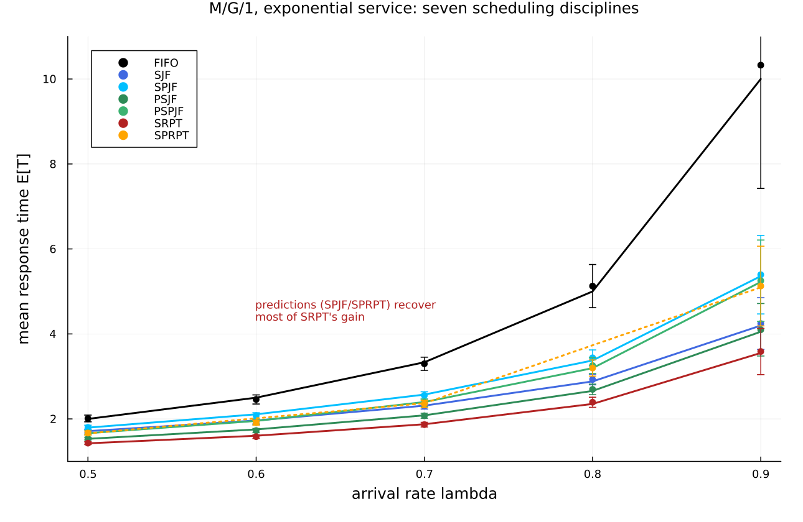
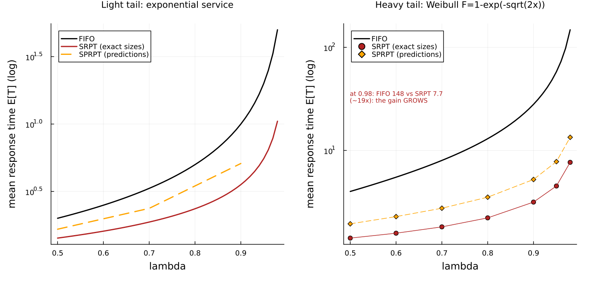
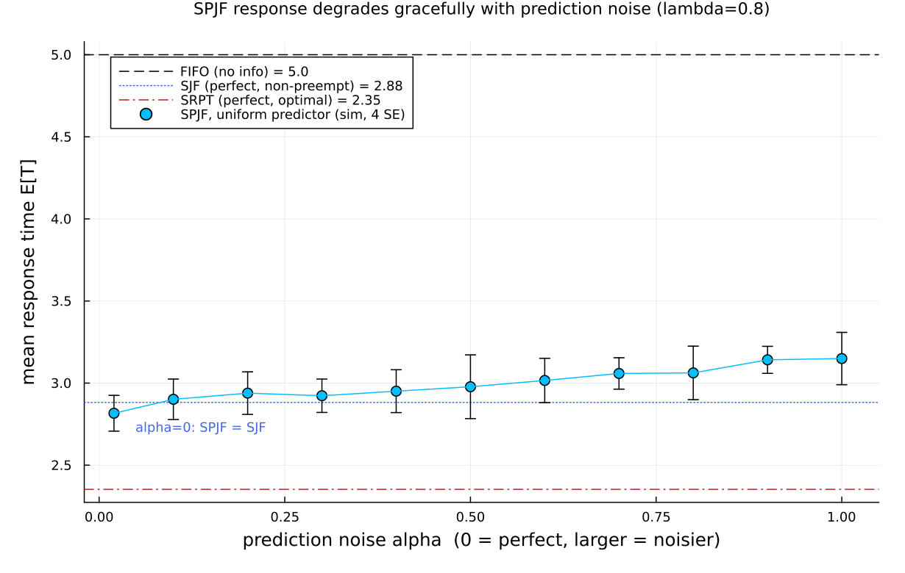

# Scheduling with predictions: an M/G/1 discipline suite

This page walks through `examples/mitzenmacher2025_predictions.jl`. It builds
**one** single-server queue and runs a whole family of scheduling rules through
it, checking the simulated mean response time against exact published numbers
from Mitzenmacher and Shahout, "Queueing, Predictions, and LLMs: Challenges and
Open Problems" (SIGMETRICS 2025 tutorial survey,
[arXiv:2503.07545](https://arxiv.org/abs/2503.07545)).

The survey's exact tables come from Mitzenmacher's two earlier peer-reviewed
papers, which we cite for the numbers:

- **[misprediction]** M. Mitzenmacher, *Scheduling with Predictions and the
  Price of Misprediction*, ITCS 2020 — the source of Survey Table 1.
- **[small-advice]** M. Mitzenmacher, *Queues with Small Advice*, 2021 — the
  source of Survey Tables 2 and 3.

## The question in one paragraph

A single server processes jobs one at a time. If it knows **nothing** about how
long each job will take, the fair thing to do is serve them in arrival order:
**FIFO** (first in, first out; also called FCFS, first come first served). If it
knows each job's **exact** size, it can do far better by always working on the
job with the least work left: **SRPT** (shortest remaining processing time),
which is provably optimal for mean response time. The interesting case is in
between: the server has only a **prediction** of each size, maybe from a machine
learning model, and the prediction can be wrong. The papers show that even a
weak prediction recovers most of SRPT's benefit. This example reproduces that
result.

Throughout, **response time** (also called sojourn or time in system) means the
whole time a job spends from arrival to completion: waiting plus service.

## The discipline zoo

A rule for choosing which job to serve next is a **discipline**. One word first:
a discipline is **preemptive** if a newly favored job may interrupt the job
currently in service (the interrupted job later resumes where it stopped), and
**non-preemptive** if the job in service always finishes first. Here are the
seven disciplines, with the acronyms spelled out:

| Acronym | Name | Uses | Preemptive? |
|---------|------|------|-------------|
| FIFO  | first in, first out | nothing (arrival order) | no |
| SJF   | shortest job first | true size | no |
| SPJF  | shortest **predicted** job first | predicted size | no |
| PSJF  | preemptive shortest job first | true size | yes |
| PSPJF | preemptive shortest **predicted** job first | predicted size | yes |
| SRPT  | shortest remaining processing time | true remaining | yes |
| SPRPT | shortest **predicted** remaining processing time | predicted remaining | yes |

The pattern is simple: the "P…" prefix adds preemption, and the "…P…" inside the
prediction names ("SP…") swaps the true size for the predicted size. FIFO uses no
size information at all; SRPT uses perfect information; the four prediction-based
rules (SPJF, PSPJF, SPRPT) sit in between.

## Why this is one M/G/1 queue with two marks

Every job carries two per-job numbers drawn when it arrives:

- its **true size** `x` (the exact service it will need), and
- a **predicted size** `y`, drawn jointly with `x`.

A per-job number sampled at the source and read downstream is exactly a
Concourse **mark**. Arrivals are Poisson (the "M"), the service law is general
(the "G" — here a deterministic time equal to the true size mark), and there is
one server (the "1"). So the whole study is a single M/G/1 station whose only
moving part is the discipline.

**The prediction model.** Following both source papers, a job of true size `x`
gets a predicted size `y` that is *exponentially distributed with mean `x`* (the
"exponential prediction model"). This is deliberately a weak predictor: it only
tends to order jobs correctly. In Concourse that is one line — the predicted
mark reads the size mark as its own mean:

```julia
mk = MarkLaw(
    size = Law(:Exponential, scale = Const(1.0)),   # true size x ~ Exp(mean 1)
    pred = Law(:Exponential, scale = Mark(:size)))   # predicted y ~ Exp(mean x)
```

**Each discipline is one argument.** The service law is always
`Law(:Dirac, value = Mark(:size))` — deterministic *given* the mark. Only the
discipline changes:

```julia
"SJF"   => Priority(Mark(:size)),                    # order by true size
"SPJF"  => Priority(Mark(:pred)),                    # order by predicted size
"PSJF"  => Priority(Mark(:size); preempt = true),
"PSPJF" => Priority(Mark(:pred); preempt = true),
"SRPT"  => SRPT(Mark(:size)),                        # rank = size - age
"SPRPT" => SRPT(Mark(:pred)),                        # rank = predicted - age
```

The last line is the neat part. Concourse's `SRPT` ranks a job by
`(its by-mark) - (age in service)` and preempts on that rank, while the job still
**completes at its true service time** (the `Dirac` law reads `Mark(:size)`).
Feeding `SRPT` the *predicted* mark therefore gives exactly the survey's SPRPT
rank `y - a` (predicted remaining), with completion at the true `x` — no new
machinery, just a different mark. When the predicted remaining goes negative
(the prediction ran out but the job is not done), the job simply has the best
possible rank and runs to completion, which is the survey's rule too.

## The exact oracles

The papers give exact equilibrium formulas, and the script implements them by
numerical integration so it carries its own ground truth, independent of the
simulator. Six of the seven values are recomputed this way and match the
published table to four decimals:

- **FIFO** is exact M/M/1: `E[T] = 1/(1-λ)`.
- **SJF** and **PSJF** are the classic non-preemptive and preemptive
  priority-by-size integrals over the true-size distribution.
- **SRPT** is the Schrage–Miller integral.
- **SPJF** and **PSPJF** are the same priority integrals taken over the *joint*
  density `g(x, y) = e^{-x} (1/x) e^{-y/x}` of size and prediction, exactly as
  derived in [misprediction].

The seventh, **SPRPT**, has no elementary closed form (its analysis is a
busy-period argument), and its published *equation* value carries a known ~1%
numerical-integration bias — the source paper truncates predicted times at 50.
For a simulator the honest target is the paper's own published *simulation*
value, so SPRPT is checked against that.

## Validation 1: seven disciplines, exponential service

Exponential service (mean 1), the exponential prediction model, all seven
disciplines at `λ = 0.5, 0.7, 0.9`. Every simulated mean agrees with the exact
number within four standard errors:

```
discipline lambda  simulated (4 SE)      exact     source          |z|
FIFO    0.5     2.01 ± 0.02           2.0       oracle(=Table1) 0.51
FIFO    0.7     3.298 ± 0.039         3.333     oracle(=Table1) 0.91
FIFO    0.9     10.326 ± 0.725        10.0      oracle(=Table1) 0.45
SJF     0.5     1.715 ± 0.011         1.713     oracle(=Table1) 0.2
SJF     0.7     2.298 ± 0.017         2.312     oracle(=Table1) 0.87
SJF     0.9     4.244 ± 0.152         4.197     oracle(=Table1) 0.31
SPJF    0.5     1.8 ± 0.013           1.795     oracle(=Table1) 0.43
SPJF    0.7     2.554 ± 0.021         2.572     oracle(=Table1) 0.85
SPJF    0.9     5.394 ± 0.231         5.36      oracle(=Table1) 0.14
PSJF    0.5     1.537 ± 0.008         1.531     oracle(=Table1) 0.65
PSJF    0.7     2.074 ± 0.015         2.084     oracle(=Table1) 0.63
PSJF    0.9     4.098 ± 0.154         4.052     oracle(=Table1) 0.3
PSPJF   0.5     1.675 ± 0.011         1.664     oracle(=Table1) 0.94
PSPJF   0.7     2.382 ± 0.021         2.397     oracle(=Table1) 0.73
PSPJF   0.9     5.252 ± 0.239         5.224     oracle(=Table1) 0.12
SRPT    0.5     1.43 ± 0.008          1.425     oracle(=Table1) 0.54
SRPT    0.7     1.865 ± 0.014         1.875     oracle(=Table1) 0.68
SRPT    0.9     3.586 ± 0.136         3.552     oracle(=Table1) 0.25
SPRPT   0.5     1.667 ± 0.012         1.659     paper sim       0.72
SPRPT   0.7     2.353 ± 0.021         2.368     paper sim       0.74
SPRPT   0.9     5.127 ± 0.234         5.097     paper sim       0.13
max |z| = 0.94  (all pass at 4 SE)
```

The table reads top to bottom as the whole point of the paper: **FIFO** is the
worst (it ignores size), **SRPT** is the best (perfect information), and the
prediction-based rules **SPJF/PSPJF/SPRPT** land in between — much closer to
SRPT than to FIFO. A weak predictor buys most of the benefit of perfect
knowledge.



The figure plots the exact curves (solid, from the oracles; SPRPT dotted from
the published simulation points) with the simulated means and their 4-SE bars on
top. At `λ = 0.9` the spread is largest: FIFO climbs to 10 while SRPT stays near
3.5 and the prediction rules sit around 5.

## Validation 2: the gain grows under a heavy tail

The second experiment swaps the light-tailed exponential service for a
heavy-tailed **Weibull** law, `F(x) = 1 − exp(−√(2x))`. Its mean is still 1, but
its second moment is 6 (versus 2 for the exponential), so a few very long jobs
dominate. Because the Pollaczek–Khinchine formula makes FIFO's delay grow with
the second moment, this is exactly where size information — and therefore
predictions — helps most.

```
discipline lambda  simulated (4 SE)      exact/pub   |z|
FIFO    0.5     3.984 ± 0.048         4.0         0.33
FIFO    0.7     8.192 ± 0.171         8.0         1.12
SRPT    0.5     1.414 ± 0.007         1.408       0.76
SRPT    0.7     1.824 ± 0.016         1.812       0.8
SPRPT   0.5     1.95 ± 0.017          1.94        0.61
SPRPT   0.7     2.788 ± 0.038         2.75        1.0
max |z| = 1.12
```

FIFO is validated against the exact Pollaczek–Khinchine value
`E[T] = 1 + 3λ/(1−λ)`; SRPT against the script's own Weibull SRPT integral;
SPRPT against the paper's published simulation value. (A footnote in honesty:
the published Weibull FIFO entry at `λ = 0.9` prints 29.00, but every other FIFO
entry equals `1 + 3λ/(1−λ)` exactly, which gives **28.00** at 0.9 — an apparent
typo, so the script uses 28.00.) High load is expensive and high-variance under
a heavy tail, so only `λ = 0.5, 0.7` are validated tightly; the trend to
`λ = 0.98` is shown as a figure.



The two panels share a log scale. On the left (exponential) the FIFO/SRPT gap at
`λ = 0.9` is about 3×. On the right (Weibull) the gap is far larger and keeps
opening: at `λ = 0.98`, FIFO is **148** while SRPT is **7.7** — roughly 19× — and
SPRPT (predictions only) is **13.4**, still an order of magnitude under FIFO.
The intuition the paper gives: long jobs blocking short ones is what inflates
delay, and even a rough prediction keeps long jobs from jumping ahead of short
ones. Predicting the *long* jobs correctly matters more than the short ones.

## Validation 3: one-bit predictions

The third experiment is the coarsest possible predictor: a **single bit** per
job, saying only whether the job is "short" or "long" relative to a threshold
`T`. Short jobs go to the front of the line, long jobs to the back. There are
two versions of the bit:

- **THRESHOLD** — a *perfect* bit, set from the true size (`x ≤ T`?). This is the
  best a one-bit advisor could do.
- **PREDICTION** — a *noisy* bit, set from the exponential prediction (`y ≤ T`?).

Both are two-class priority queues in Concourse. A "short vs long" bit is a
step-function ordering key, which the surface algebra builds from `ceil/min/max`
(no comparison operator needed), so no new discipline is required:

```julia
# 0 for jobs with key ≤ T ("short"), 1 for jobs above T ("long"); FCFS within a class
oneb_key(e, T) = ceil(min(max(e - Const(T), Const(0.0)), Const(1.0)))
Priority(oneb_key(Mark(:size), T))     # THRESHOLD (perfect bit), non-preemptive
Priority(oneb_key(Mark(:pred), T))     # PREDICTION (noisy bit), non-preemptive
```

We validate the **non-preemptive** mean response `t₁` of both schemes against the
exact closed forms of [small-advice] at `λ = 0.5, 0.7, 0.9`:

```
scheme      lambda  T*     sim t1 (4 SE)       exact t1  |z|
THRESHOLD   0.5     1.28   1.802 ± 0.01        1.782     1.99
PREDICTION  0.5     0.9    1.849 ± 0.008       1.849     0.11
THRESHOLD   0.7     1.51   2.564 ± 0.023       2.542     0.99
PREDICTION  0.7     1.2    2.798 ± 0.044       2.762     0.83
THRESHOLD   0.9     2.1    5.188 ± 0.142       5.284     0.67
PREDICTION  0.9     2.08   6.376 ± 0.217       6.368     0.04
max |z| (non-preemptive t1) = 1.99
```

The optimal threshold `T*` is found in the script — analytically for THRESHOLD
(the root of `λ = (T−1)/(e^{−T}+T−1)`) and by a small numerical minimization for
PREDICTION (whose closed form involves Bessel-function integrals, computed here
by the same quadrature). Even the noisy one-bit PREDICTION lands far below FIFO:
at `λ = 0.9`, 6.4 versus FIFO's 10.

### The exact identity, and an honest exclusion

[small-advice] proves a clean identity between the non-preemptive mean response
`t₁` and the **preemptive** mean response `t₂` at the optimal threshold:
**`t₁ = λ·t₂ + 1`** (preemption always helps). The script confirms this identity
holds for the exact closed forms to machine precision (residuals ~10⁻¹⁵).

The *preemptive* scheme itself, however, is **not** something Concourse's
discipline surface expresses, and this is worth stating precisely. In the paper's
preemptive threshold, *any* arriving short job preempts the job in service —
**including another short job** — so the short class is served
last-come-first-served preemptive-resume, and a short of size `t` has sojourn
`t/(1−ρ(T))`. Concourse's `Priority(...; preempt = true)` evicts the job in
service only when a waiting job is **strictly** better, so two jobs of the same
class (equal key) never preempt each other — the short class is FCFS. That is a
different, also-valid discipline ("class-preemptive, FCFS within class"), and its
mean response is genuinely different from the paper's `t₂` (a per-class check in
the script confirms the short-class sojourn matches the FCFS value, not the
LCFS-preemptive-resume value). So the simulated `t₂` and the `t₁ = λ·t₂ + 1`
identity are out of scope for the simulator; the identity is verified only for
the closed forms. Note the continuous-size preemptive disciplines PSJF, PSPJF,
and SRPT are unaffected — with distinct sizes there are no ties, so "strictly
better" fires for every smaller job, exactly as those disciplines require.

## What about prediction quality?

The last figure sweeps prediction *noise* directly. It uses a different, tunable
predictor from [misprediction]: a job of size `x` gets a predicted size uniform
on `[(1−α)x, (1+α)x]`. At `α = 0` the prediction is perfect (so SPJF becomes
SJF); larger `α` is noisier.



At `λ = 0.8`, SPJF's mean response rises smoothly from the SJF value as `α`
grows, staying well below the FIFO baseline across the whole range. This is the
"graceful degradation" the survey emphasizes: performance tracks prediction
quality continuously, so a mediocre predictor is still worth a lot.

## Honest scope

- **Reproduced exactly** (validated at 4 SE against exact numbers, max |z| under
  2): FIFO, SJF, SPJF, PSJF, PSPJF, SRPT for exponential service (Survey Table 1);
  FIFO and SRPT for Weibull service (Survey Table 3); the non-preemptive
  THRESHOLD and PREDICTION one-bit schemes `t₁` (Survey Table 2).
- **Validated against the paper's published simulation value** rather than a
  re-derived oracle: SPRPT (no elementary closed form; its published equation
  value has a ~1% integration bias).
- **Excluded, with reason:** the *preemptive* one-bit threshold `t₂` and the
  `t₁ = λ·t₂ + 1` identity. The paper's preemptive threshold needs shorts to
  preempt shorts (LCFS-preemptive-resume within a class), which Concourse's
  strictly-better-key preemption does not express; the identity is verified only
  for the closed forms. (SPRPT — shortest *predicted* remaining processing time —
  is, by contrast, fully expressible: `SRPT(Mark(:pred))`.)
- **Calibrated vs exact:** nothing is calibrated here. Every target is an exact
  equilibrium value or an exact algebraic identity from the source papers. The
  only approximations are the numerical quadratures used to evaluate the
  integral formulas, which match the published tables to their printed digits.
- **Out of scope:** the survey's LLM-systems sections (KV-cache memory limits,
  prefill/decode phases, batching), its competitive-analysis bounds (§2.3), the
  prediction-cost models SkipPredict/DelayPredict (§2.4), and the multi-server
  power-of-two-choices fluid limits (§2.5). This example is only the
  single-queue M/G/1 prediction theory of §2.1–2.2.

## What this demonstrates about Concourse

- A predicted size is just a second mark drawn jointly with the true size; the
  entire prediction study rides on `pred = Law(:Exponential, scale = Mark(:size))`.
- Seven textbook disciplines are seven one-argument choices. Notably, SPRPT
  needs no new discipline: `SRPT(Mark(:pred))` ranks by predicted-remaining while
  the job still completes at its true size.
- A one-bit "short/long" advisor is a step-function priority key assembled from
  `ceil/min/max` in the surface algebra — a two-class priority queue with no new
  code.
- The response times are read by folding over the replayed record (departure
  minus arrival), and every discipline is checked against an exact equilibrium
  number — six recomputed in-script by quadrature, the rest cited — so the
  simulator is held to the published theory across the whole zoo.

## Running it

```
julia --project=examples examples/mitzenmacher2025_predictions.jl
```

Runtime is a few minutes; the figures land in `docs/figures/` and
`docs/src/manual/figures/`. The docs build does **not** run the simulation — the
committed PNGs are the artifacts this page embeds.
