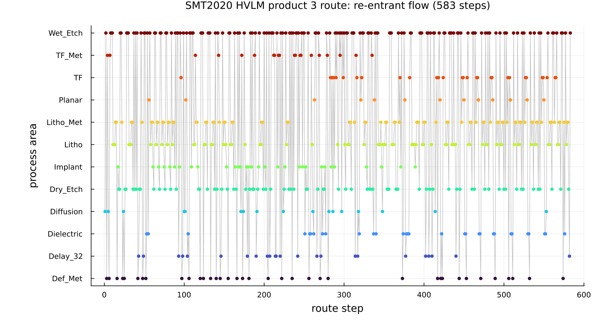
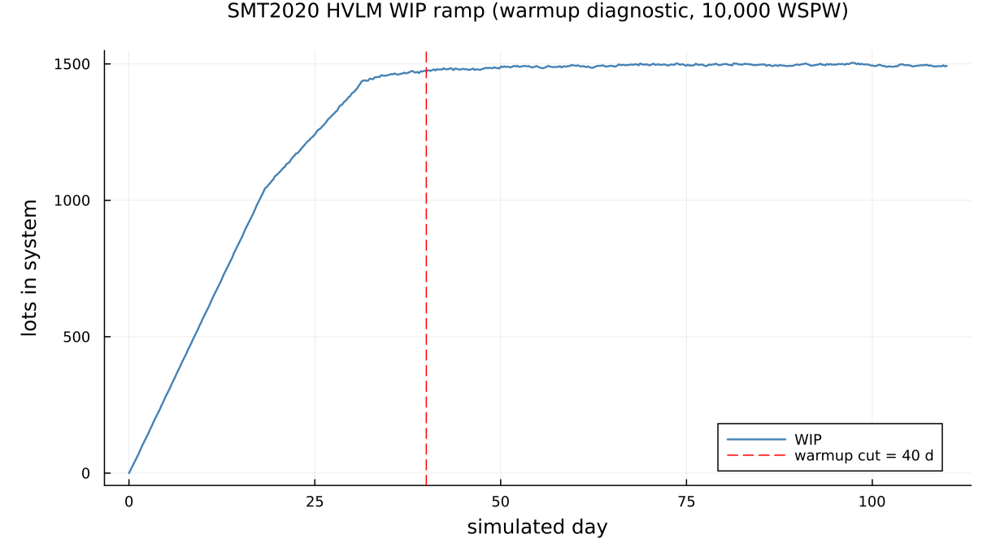
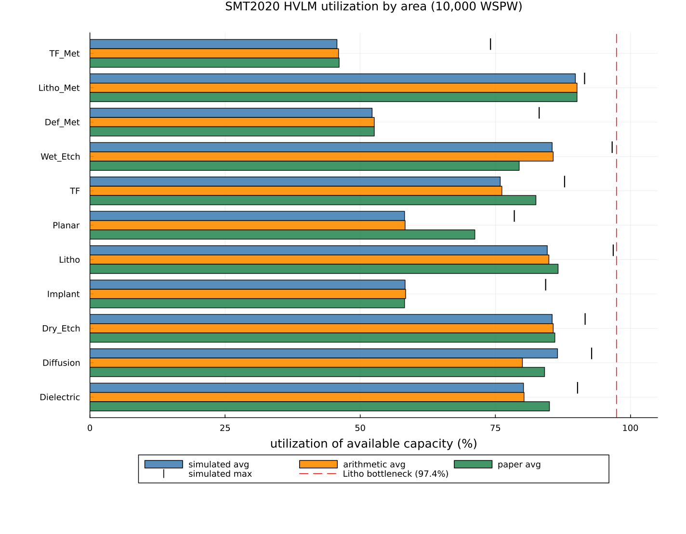
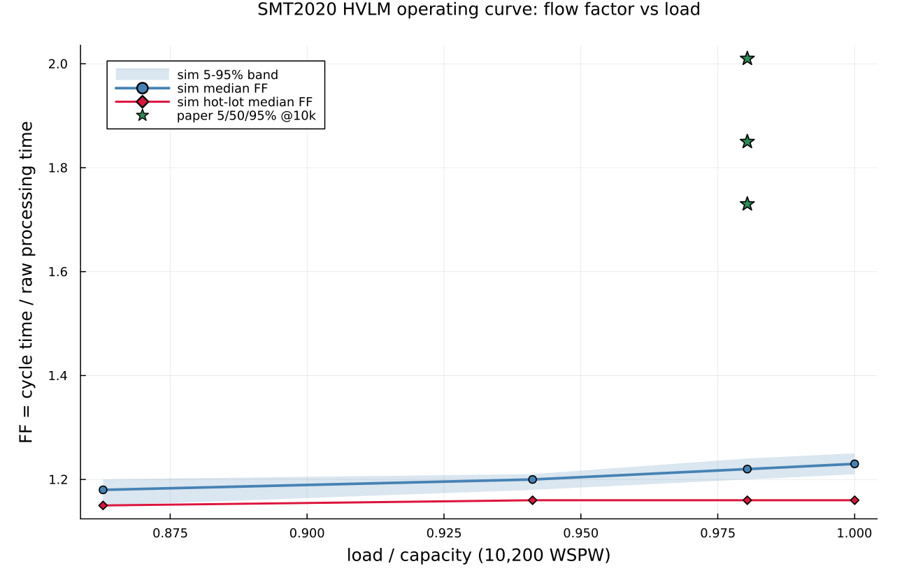

# A reduced discrete-event model of the SMT2020 wafer fab

This page walks through `examples/smt2020_hvlm.jl`: a reduced discrete-event
model of the SMT2020 dataset-1 (High-Volume/Low-Mix, "HVLM") semiconductor
manufacturing testbed. It builds a 281-station, 926-route-step re-entrant fab
from four minute-normalized CSVs, reproduces the paper's raw-processing-time
(Table II) and utilization (Table III) numbers, and draws an operating curve.
The reference is Kopp, Hassoun, Kalir & Mönch, "SMT2020 — A Semiconductor
Manufacturing Testbed" (*IEEE Trans. Semiconductor Manufacturing* 33(4):522–531,
2020, DOI [10.1109/TSM.2020.3001933](https://doi.org/10.1109/TSM.2020.3001933)).
The numerical data are the paper's reference set, downloaded from Lars Mönch's
group at FernUniversität in Hagen; provenance is in
[`examples/smt2020_hvlm_data/README.md`](https://github.com/adolgert/Concourse.jl/blob/main/examples/smt2020_hvlm_data/README.md).

Where the Yang LLM example is an M/G/1 queue you can check against a closed-form
oracle, this one is at the opposite end of the scale: a full industrial fab
model, hundreds of stations and nearly a thousand route steps, whose point is to
show that Concourse's surface language can *express* such a system at all, and
that the machinery it compiles to is quantitatively correct where an independent
offered-load calculation says it should be.

## Four terms, for a reader who has never seen a fab

**A wafer fab** turns blank silicon wafers into finished chips by depositing,
patterning, and etching material one thin layer at a time. Wafers travel in
**lots** (here, 25 wafers to a lot) and are processed by **tool groups** —
pools of identical, expensive machines (a litho group might hold 28 steppers).
A fab is a queueing network: lots are jobs, tool groups are multi-server
stations, and a "route" is the ordered list of ~hundreds of process steps a
lot must complete.

**Re-entrant flow** is the feature that makes a fab unlike an ordinary job shop.
Each of the ~44 mask layers a chip needs is built by the *same* handful of
areas — lithography, etch, deposition — so a lot returns to the litho group
dozens of times over its route, each time competing with lots at completely
different layers. A single tool group therefore sees the same lot again and
again at different points in its life. The product-3 route below visits 105
distinct tool groups across 583 steps: the visit-count sawtooth is the whole
character of the system.

**Raw processing time (RPT)** is how long a lot's route would take with the fab
otherwise empty — pure processing plus handling plus transport, no waiting in
any queue. It is the denominator of everything.

**Flow factor (FF)**, also called cycle-time multiplier or x-factor, is the
ratio of realized **cycle time** (release to completion, queueing included) to
raw processing time: `FF = CT / RPT`. FF = 1 is a fab with no queues; a real
loaded fab runs FF ≈ 1.5–2.5. The **operating curve** plots FF against fab load
(wafer starts per week as a fraction of capacity): it is flat and low while the
fab is underloaded, then rises sharply as load approaches capacity and queues
explode. Reproducing that curve is the headline test — and, as we will see, the
place where this reduction's dropped physics shows up most plainly.

## What the fab is

The HVLM testbed runs two products through 105 real tool groups (1043 tools)
plus one virtual hold station. Product 3 has a 583-step route, product 4 a
343-step route; both are heavily re-entrant. Regular lots of each product
release every 51.69 min and hot lots every 2016 min, giving ~10,000 wafer
starts per week (WSPW) against a stated capacity of ~10,200 WSPW. The
re-entrant structure is best seen directly:



Each point is one route step, placed at its step index (x) and its process area
(y). The vertical scatter is the re-entrancy: the route climbs and dives through
the same dozen areas hundreds of times. Wet-etch and litho-metrology groups
dominate — product 3's single most-visited group (`WE_FE_108`) is hit 52 times,
`Delay_32` 24 times. There is no "assembly-line" ordering to exploit; every tool
group is shared across the whole life of every lot.

## Why this maps to Concourse

The mapping rests on one idea: **a lot's global route position is a mark.** Every
lot carries an integer `step`; a shared transport hub increments it on every
deposit and a single route table sends the lot to whatever station that step
names. The lot's product and priority are two more marks. With those three marks
and a table-driven service law, the entire 926-step re-entrant fab is expressed
without any per-step station wiring: one hub, one route table, one service law,
and ~124 tool stations that all look up their own occupancy from the mark.

This is the payoff of the surface language being *data-driven*. Nothing about
the model is written per step; the routes are read from CSV and turned into
lookup tables at compile time.

## The reduction: what is kept, what is dropped

The example is deliberately a *reduced* model — it keeps the physics that sets
capacity and drops the physics that only perturbs it, each drop with a
quantified bound (from the data pre-validation in the project's `analysis.md`).

**Kept** (these define real capacity and cannot be dropped):

- **Availability** `A` per tool group, from PM + breakdown, precomputed in
  `toolgroups.csv` and validated against Table III availability to ≤0.2 points
  on all 11 areas. Enters the model as a capacity derate (below).
- **Cascading** — the wafer- and lot-pipelining that determines how fast a tool
  really frees up.
- **Batching** — the diffusion furnaces (75–150 wafers = 3–6 lots per batch)
  are the dominant furnace time.
- **Sampling probabilities** — metrology steps are visited only with their
  sampling probability (mean ≈ 36%); dropping them would overstate metrology
  load by ~2.8×.
- **The `Delay_32` hold delays** (up to ~3 days of the 27-day product-3 RPT) and
  **transport** (~10% of RPT).

**Dropped** (each with its bound):

| Dropped feature | Quantified bound / effect |
|---|---|
| Sequence-dependent setups | ≤1.1% of total processing minutes as an upper bound; the known cause of the Implant max-util residual |
| Rework loops | ≤1.8% probability, 2-step loops → <2% flow inflation (inside the RPT margin) |
| CQT (critical-queue-time) links | 41/25 forward links, invisible to offered load, second-order at these utilizations |
| Lot-to-lens (LTL) dedication | 11/7 litho steps; affects tool assignment within a group, not group-level load |
| SuperHotLot stream | ≈0.19% of product-3 releases; dropped, matches the oracle |
| **Downtime *dynamics*** | only the capacity *mean* of PM + breakdown is kept (via 1/A); the *variability* of downtime is dropped — **this is the headline caveat** |

That last row is the important one. The reduction keeps the average capacity
lost to downtime but not its bursty timing, and, exactly as in the Yang
example's monotone-delay curve, that missing variability is what makes the
simulated operating curve sit below the paper's.

## The architecture that makes a 926-step re-entrant fab expressible

### Step-index-as-mark, incremented by a shared hub

Global step ids namespace the two routes: product 3 uses `1..583` (sink at 584),
product 4 uses `1001..1343` (sink at 1344). A source stamps `step = j0-1` (0 or
1000); one shared infinite-server transport hub increments `step` on every
deposit via a `remark`, so a lot arrives at the hub, its step advances, and the
route table sends it onward:

```julia
station!(net, :hub; servers = 1_000_000, discipline = FCFS(),
         service = hub_service,
         remark = (step = Law(:Dirac, value = Mark(:step) + Const(1.0)),))
```

The hub's own service law is where transport time (and a latency deficit,
below) is drawn. Because the hub is infinite-server, incrementing the step
never itself becomes a bottleneck; it is pure bookkeeping riding on the
transport delay every lot pays anyway.

### One big `ByMark` route table

Every reachable global step — all 928 of them — is a breakpoint in a single
`ByMark` route that both the real hub and the skip-hub share. It is an
`O(log n)` binary search over the sorted step ids, dispatching each lot to its
next tool group, sampling gate, batch substation, or sink:

```julia
vals = sort!(collect(keys(dest_kind)))
cutoffs = Float64[vals[i] + 0.5 for i in 1:length(vals) - 1]
dests = Symbol[]
for v in vals
    k = dest_kind[v]
    push!(dests, k == :batch ? batch_of[v].sym :
                 k == :gate  ? Symbol("g", v) :
                 dest_sym[v])
end
route!(net, :hub, ByMark(Mark(:step), cutoffs, dests))
route!(net, :skiphub, ByMark(Mark(:step), cutoffs, dests))
```

There is exactly one route table for the whole fab. Adding a step is adding a
row to the CSV, not a station to the network.

### `Opaque` table-lookup service laws

The tool groups are pure processors that share a single service law. It reads
the lot's `step` mark, looks the (availability-inflated) occupancy up in a
table, and draws `Uniform(±5%)` around it:

```julia
tool_service = Opaque((θ, marks, te) -> begin
        o = max(get(OCC, Int(marks.step), 1e-6), 1e-9)
        Uniform(0.95 * o, 1.05 * o)
    end; marks = [:step])
```

Every re-entrant visit to a group hits the same station and the same law; the
mark alone selects the right per-step processing time. `Opaque` is what lets one
law stand in for what would otherwise be hundreds of per-step service
definitions.

### Capacity-equivalent 1/A derating

Availability enters as a service inflation, not as explicit downtime events.
With `derate` on, every tool's busy time is multiplied by `1/A`, so the
simulated busy fraction reads *directly* as the paper's "utilization of
available capacity":

```julia
A = derate ? g.availability : 1.0
occ, lat = occ_lat(s, g)
occ_i = occ / A
```

This is the deliberate reduction: keep the mean capacity that downtime removes,
drop its dynamics.

### The lot-cascade occupancy/latency deficit trick

Cascading tools free up faster than a lot actually leaves them. For a
lot-cascade step the tool is busy for only one *cascade interval* (throughput
view), but the lot itself resides for the full processing time (latency view).
The two differ by a **latency deficit** that must be added to cycle time without
consuming tool capacity:

```julia
function occ_lat(s::RouteStep, tg::ToolGroup)
    L, U = tg.load, tg.unload
    ...
    else                                      # :Lot
        if isnan(s.cascade)
            base = s.pt + L + U
            return base, base
        else
            return s.cascade + L + U, s.pt + L + U     # occ = throughput, lat = full PT
        end
    end
end
```

The deficit `max(0, lat - occ/A)` is paid later, at the infinite-server hub,
where it is folded into the transport draw of the *next* step. Occupancy
consumes the tool; the deficit only consumes cycle time. This keeps utilization
and latency both correct without double-counting.

### Sampling gates

A metrology step visited with probability `p < 1` becomes an infinite-server
gate that flips a `Probabilistic` coin — go to the tool with probability `p`,
or skip to a zero-cost skip-hub (which still advances the step) with probability
`1-p`:

```julia
route!(net, sym, Probabilistic(gate_tool[gid] => p, :skiphub => 1 - p))
```

The skip-hub costs no transport, so a skipped inspection neither loads the tool
nor adds cycle time — exactly an expected-visit-rate `p`.

### The per-(product, step) diffusion Batching split

The furnace batch criterion in the data is "Same Product and Same Step", but
Concourse's `Batching` gathers FCFS regardless of marks. So each of the 10
diffusion groups is **split** into one `Batching` substation per (product, step),
with the group's tools apportioned across substations by largest-remainder
proportional to offered busy-minutes (group total preserved, every substation
≥2 tools):

```julia
station!(net, sym; servers = seats[k], discipline = FCFS(),
         batching = Batching(min = bmin, max = bmax),
         service = Law(:Uniform, lower = Const(0.95 * occ_i),
                       upper = Const(1.05 * occ_i)))
```

This enforces homogeneous batches exactly, at the cost of lost furnace pooling
flexibility — a capacity-**conservative** approximation (dedicated tools can
only raise utilization, never hide it). A single pooled furnace with mixed
batches would violate the criterion and be optimistic. As E2 shows, the split
furnaces run slightly *fuller* than the mid-fill oracle, which is the expected
direction.

## The three-layer validation story

Because there is no closed-form oracle for a fab this size, validation is done
in three layers, each checking a different thing.

**Layer 1 — closed-form offered-load arithmetic vs the paper.** Before any
simulation, a pure expected-value calculation (no queueing) reproduces the
paper's Tables II/III: **availability matches to ≤0.2 points on all 11 areas**,
the **litho bottleneck is reproduced exactly** (Litho_BE_110 at 97.5% vs the
paper's Litho max 97.4%), and **RPT matches to <1%** for both products. This
validates that the reduced CSVs faithfully encode the fab.

**Layer 2 — simulation vs that arithmetic.** The discrete-event run is then
checked against the same offered-load numbers. The simulation tracks the
arithmetic oracle to **≤0.4 points on 10 of 11 areas** — this is the layer that
validates the Concourse machinery (derate, occupancy/deficit, sampling, batching,
re-entrant routing), independent of whether the arithmetic itself matches the
paper.

**Layer 3 — simulation vs the paper.** Where the arithmetic and the paper
already disagree (the dropped physics), the simulation reproduces the
arithmetic, not the paper. The operating curve is the sharpest case: the
simulated flow factor is a flat ≈1.22 where the paper's is 1.85. That gap is the
headline caveat, and it is the *quantified* signature of the dropped downtime
dynamics.

## E1: raw processing time in an empty fab

Setting the release load to 1 WSPW stretches the regular interval to
`51.69 × 10000` min — far longer than any lot's cycle time — so the fab holds at
most one lot per product and cycle time collapses to raw processing time. In
`rpt_mode` every batch minimum is set to 1 lot (furnaces do not wait to fill,
the paper's RPT convention). The gate is `|sim − oracle| / oracle ≤ 2%`:

```
== E1: raw processing time (empty fab, rpt_mode) ==
  product 3: sim RPT = 27.43 d (n=61)   arith(jl,no-rework) = 27.41 d   oracle = 27.42 d   paper = 27.18 d
  product 4: sim RPT = 16.09 d (n=61)   arith(jl,no-rework) = 16.09 d   oracle = 16.10 d   paper = 15.96 d
  gate |sim-oracle|/oracle: p3 = 0.02%  p4 = 0.09%  (target <= 2%)
```

Both products pass at two hundredths of a percent. This one test exercises the
whole route mechanism end to end — occupancy, latency, the cascade deficit,
transport, sampling, batching (at min = 1), and the cycle-time extraction from
the replayed record — and confirms the reduced model reconstructs the paper's
Table II to within its own 1% arithmetic margin.

## E2: utilization at the 10,000 WSPW working point

The working-point run warms the fab for 40 sim-days and measures for 70, with
the derate on so busy fraction reads as utilization-of-available-capacity. The
warmup cut is justified by the WIP ramp:



WIP climbs from empty to ~1451 lots by day 33 and plateaus near ~1490 by day 44;
the 40-day warmup cut (dashed line) sits safely on the plateau. Steady WIP is
~1500 lots — the number that governs runtime, since each event's cost grows with
WIP.

The measurement is a single streaming fold over the record, integrating each
tool group's busy-server count over the measurement window. The three-way table
compares the simulation to the offered-load arithmetic oracle and to the paper:

```
== E2: utilization at 10000 WSPW ==
  simulating 110 sim-days (warmup 40 + measure 70)...
  5144183 firings in 688.4s (7473/s)

  area        sim_avg  sim_max | oracle_avg oracle_max | paper_avg paper_max
  Dielectric     80.2     90.2 |      80.3       90.3 |     85.0     89.8
  Diffusion      86.5     92.8 |      80.0       89.3 |     84.1     90.0
  Dry_Etch       85.5     91.6 |      85.7       91.7 |     86.0     91.8
  Implant        58.3     84.3 |      58.4       84.3 |     58.2     89.9
  Litho          84.6     96.8 |      84.9       97.5 |     86.6     97.4
  Planar         58.2     78.5 |      58.3       78.5 |     71.2     87.2
  TF             75.9     87.8 |      76.2       88.2 |     82.5     90.3
  Wet_Etch       85.5     96.6 |      85.7       96.7 |     79.4     89.7
  Def_Met        52.2     83.1 |      52.6       84.0 |     52.6     84.0
  Litho_Met      89.8     91.5 |      90.1       91.7 |     90.1     91.7
  TF_Met         45.7     74.1 |      46.0       74.8 |     46.1     74.9
```



The figure shows simulated / arithmetic / paper average utilization per area as
grouped bars, with simulated maxima as tick marks and the 97.4% litho bottleneck
as a reference line. Reading the layers:

- **Simulation vs arithmetic (Layer 2): ≤0.4 points on 10 of 11 areas.** The
  derate, occupancy, and re-entrant routing machinery reproduces the offered-load
  oracle almost exactly. The litho maximum lands at 96.8% (oracle 97.5%, paper
  97.4%) — the bottleneck is reproduced. This is the result that validates
  Concourse.
- **Diffusion sits *above* the oracle** (86.5/92.8 sim vs 80.0/89.3 oracle,
  84.1/90.0 paper): the split furnaces run fuller than the mid-fill assumption,
  the expected direction of the capacity-conservative batch split. The maximum,
  92.8%, is ~2.8 points over the paper.
- **Wet_Etch overshoots the paper in both sim and arithmetic** (85.5/96.6 sim ≈
  85.7/96.7 oracle vs 79.4/89.7 paper). Offered-load arithmetic credits Wet_Etch
  with the full 10k WSPW, but in a real fab the upstream litho gate (~97%) throttles
  it. Here litho tops out at 96.8% rather than fully saturating, so it does not
  clamp Wet_Etch, and both sim and arithmetic overstate it by ~6–7 points. The
  missing throttle is again the paper's downtime *dynamics*.
- **Planar / TF / Dielectric and the Implant maximum sit below the paper.**
  Planar and TF inherit the lot-cascade lower-bound residual (the pure
  cascade-interval occupancy rule is a lower bound when a cascade's internal
  parallelism `K` is unknown, the single largest modeling ambiguity in the
  dataset). The Implant maximum (84.3 sim/oracle vs 89.9 paper) misses by exactly
  the dropped Implant gas setups (72–80 min changeovers that live off-route). In
  every case the simulation faithfully reproduces the *arithmetic*, not the paper
  — which is the point of Layer 2.

## E3: the operating curve, and the headline caveat

The operating curve sweeps four loads spanning below, at, and above capacity,
each a ~5M-firing simulate plus an equal-cost measurement fold. Flow factor is
`CT / RPT_paper(product)`, pooled over regular lots released inside a window
that leaves every lot a 50-day completion buffer (so long-CT lots near capacity
are not preferentially right-censored out of the tail). Hot-lot median FF is
overlaid, and a split-half dispersion of the median is reported as a stability
diagnostic:

```
== E3: operating curve (FF percentiles vs load) ==
  load  8800 WSPW (0.863 cap): n_reg=980 median FF=1.18 [5%=1.15 95%=1.20] hotFF=1.15  split-half=0.004  (4309541 firings, 463s)
  load  9600 WSPW (0.941 cap): n_reg=1068 median FF=1.20 [5%=1.18 95%=1.21] hotFF=1.16  split-half=0.004  (4691633 firings, 575s)
  load 10000 WSPW (0.980 cap): n_reg=1114 median FF=1.22 [5%=1.20 95%=1.24] hotFF=1.16  split-half=0.005  (4873972 firings, 608s)
  load 10200 WSPW (1.000 cap): n_reg=1136 median FF=1.23 [5%=1.21 95%=1.25] hotFF=1.16  split-half=0.006  (4957959 firings, 619s)
```



The figure plots simulated median flow factor with a 5–95% band against
load/capacity, the hot-lot median overlaid, and the paper's 5/50/95% flow-factor
values at 10,000 WSPW marked for reference.

**The headline caveat.** The simulated operating curve is *flat and low*: median
FF rises only from 1.18 to 1.23 across the whole 0.86→1.00 capacity sweep, and
even at capacity there is no blow-up. The paper reports median FF ≈ 1.85 at
10,000 WSPW (5–95% band [1.73, 2.01]). At the working point the simulation gives
median FF = 1.22 [1.20, 1.24] — a cycle time of ~33 days (RPT 27.4 + ~5.6 days
queueing) against the paper's ~50 days (~23 days queueing). The gap is not noise:
the split-half dispersion of the median is 0.004–0.006, rock stable.

The gap is the **dropped downtime dynamics**, made quantitative. With
deterministic capacity (the 1/A derate), many-server groups (litho 28 tools,
wet-etch 35), and tight `Uniform(±5%)` service, queueing variance is low and no
downtime bursts pile lots up — so the fab queues far less than the real one. The
paper's ~23 days of queueing comes largely from the burstiness of PM and
breakdown, which this reduction averages away. This is the same story as the
Yang example's monotone-delay curve sitting below its data: a reduction that
keeps the mean and drops the variability lands *below* the reference, in a
direction you can predict and explain. Hot-lot FF (~1.16) barely differs from
the regular median — non-preemptive priority hardly matters when queues are this
short.

## What this demonstrates about Concourse

- **A near-thousand-step re-entrant fab is data-driven, not hand-wired.** One
  step-index mark, one hub that increments it, one `ByMark` route table over 928
  steps, and one `Opaque` table-lookup service law express the whole network;
  the routes come from CSV. There is no per-step station wiring anywhere.
- **The surface language composes the fab-specific physics from stock parts.**
  The cascade occupancy/latency deficit rides the infinite-server hub's
  transport draw; sampling is a `Probabilistic` gate to a zero-cost skip-hub;
  availability is a capacity derate folded into the service law; homogeneous
  furnace batches are per-(product, step) `Batching` substations with
  largest-remainder tool apportionment.
- **Validation is layered and honest.** Layer 1 (arithmetic vs paper) checks the
  data; Layer 2 (sim vs arithmetic, ≤0.4 pt on 10/11 areas) checks the Concourse
  machinery; Layer 3 (sim vs paper) exposes exactly where the reduction's dropped
  physics lives. The simulation reproduces the arithmetic it is built from, and
  the residuals — Diffusion above, Wet_Etch overshooting, Planar/TF's cascade
  lower bound, Implant's dropped gas setups, the flat FF curve — each have a named
  cause.
- **The measurement is a fold over the replayed record**, not counters bolted
  into the simulator: utilization is the time-average busy-server count over a
  measurement window, cycle time is read from job birth/death in state
  membership, both reconstructed from the record after the fact.

## Running it

```
julia --project=examples examples/smt2020_hvlm.jl
```

Runtime is dominated by E2 and E3. Steady-state throughput is ~6.5–8k firings/s
at full WIP (~1500 lots, which is what makes each event's cost grow); the E2
record is ~5M firings (~0.5 GB), and each of the four E3 load points is another
~5M-firing simulate plus an equal-cost measurement fold. Budget roughly **2 to
2.5 hours** for the whole script on a laptop. E0 prints a live steady-state
throughput estimate first so the rest is predictable. The horizons are long by
necessity: the horizons were sized for the *paper's* cycle time at the working
point (~1.85 × RPT ≈ 50 days), so that the E3 measure window and its 50-day
completion buffer cannot right-censor long-cycle-time lots out of the FF tail
even if the model queued as much as the real fab does.

The docs build does **not** run the simulation — the committed PNGs in
`docs/src/manual/figures/` are the artifacts this page embeds.
