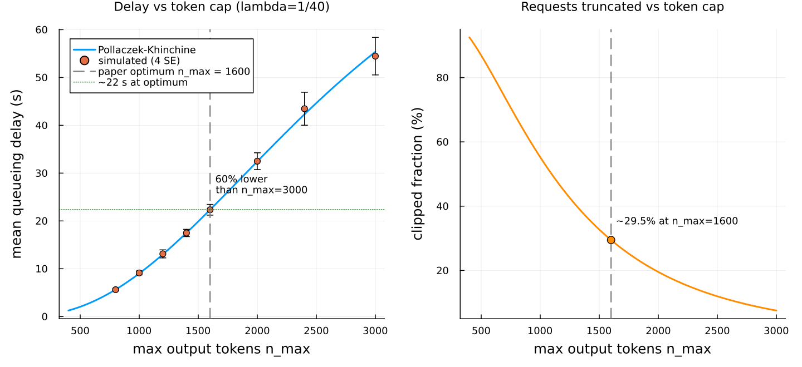
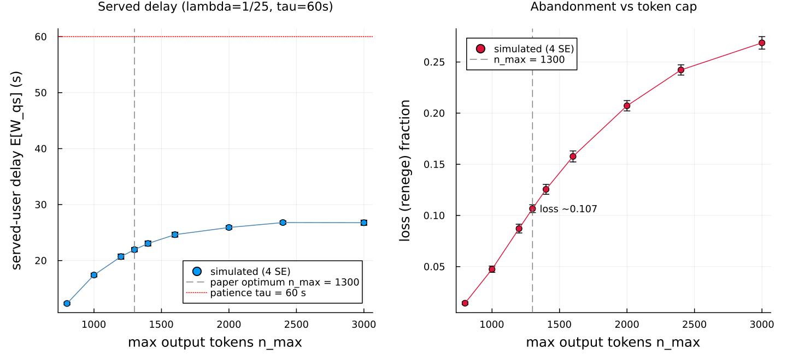
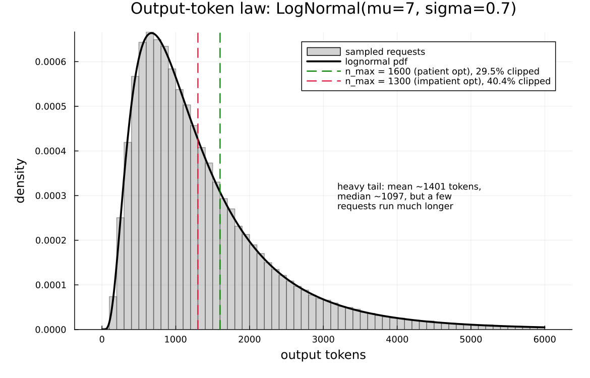

# An M/G/1 model of an LLM inference server

This page walks through `examples/yang2024_llm_mg1.jl`: a single-GPU
large-language-model inference server, modeled as an M/G/1 queue with a
per-request *mark*, checked against the exact Pollaczek–Khinchine theory,
and used to reproduce the headline numbers of Yang, Jiao & Xu, "A Queueing
Theoretic Perspective on Low-Latency LLM Inference with Variable Token
Length" (WiOpt 2024, arXiv:2407.05347,
[arxiv.org/abs/2407.05347](https://arxiv.org/abs/2407.05347)).

The paper's Sections IV–V on GPU *batching* (bulk-service and elastic
batching) are out of scope; this example reproduces only the single-server
M/G/1 model of Sections II–III: max-token clipping, the impatient-user
reneging variant, and the queueing-delay figures.

## What the server does

An LLM answers a request by generating output tokens one at a time. Each
new token is a fresh forward pass through the model, so a reply that runs
to 2000 tokens costs roughly ten times as long to produce as one that
stops at 200. The completion time of a request is therefore *affine in its
output length*:

    S = a · n + c        (a in seconds/token, c in seconds),

where `n` is the number of output tokens the request ends up generating.
Input length barely matters — the paper measures its effect on latency as
negligible (about 8% over a 64→512 input range, versus 8× over a
128→1024 output range) — so the model ignores it and keeps only the output
count.

The catch is that output length is *unpredictable and heavy-tailed*. The
paper models it as a lognormal law with log-mean μ = 7 and log-std σ = 0.7
(natural log): a median around 1097 tokens, a mean around 1401, but a long
right tail of occasional very long completions. In a first-come
first-served single-GPU server, those rare long answers are exactly what
inflates everyone else's waiting time: the Pollaczek–Khinchine formula
makes mean queueing delay proportional to `E[S²]`, the *second* moment of
service, which a heavy tail dominates.

The intervention the paper studies is **max-token clipping**: cap every
request at `n_max` output tokens, so `n = min(N, n_max)`. This shears the
right tail of the service law, collapses `E[S²]`, and sharply cuts mean
queueing delay — at the cost of truncating a fraction of answers (the
"clipped fraction"). Smaller `n_max` means lower delay but more answers cut
short. A second variant adds impatient users who *abandon* the queue if
they have waited longer than a fixed patience τ; there, clipping shows up
as a reduced loss fraction rather than reduced delay.

## Why this is an M/G/1 queue with a mark

Every request carries its own output length, drawn when it arrives and read
by the service law when it reaches the GPU. That is exactly what a *mark*
is in Concourse: a per-job attribute sampled at the source and consumed
downstream. The arrival stream is Poisson (the "M"), the service law is
general (the "G" — an affine function of a lognormal count), and there is
one server (the "1"). The token count is the mark; the affine law turns it
into a service time.

## The Concourse model

The source stamps every request with its output-token count as a *chained*
mark. The first draw is the raw lognormal length; the second is a
deterministic (`Dirac`) mark that rounds up and clips it. There is no
`Truncated` law in the surface algebra — its `logccdf` produces `NaN`
`ForwardDiff` partials — so clipping is done with `min`/`ceil` on the drawn
value. That is *censoring*, not renormalized truncation, which is exactly
the paper's rule `n = min(N, n_max)`: the request count is unchanged, long
requests are shortened rather than dropped.

```julia
mk = MarkLaw(
    raw = Law(:LogNormal, meanlog = Const(MU), sdlog = Const(SIGMA)),
    n = Law(:Dirac, value = min(ceil(Mark(:raw)), Const(float(n_max)))))
source!(net, :arrive;
        interarrival = Law(:Exponential, scale = inv(Param(:lambda))),
        mark = mk)
service = Law(:Dirac, value = Const(A) * Mark(:n) + Const(C))
```

The GPU is a single FCFS server whose service law is the `Dirac` above —
deterministic *given the mark* `n`, but random across requests because `n`
is. The impatient variant adds a deterministic patience clock and routes an
abandoning job to a loss sink:

```julia
if patient
    station!(net, :gpu; discipline = FCFS(), servers = 1, service = service)
else
    station!(net, :gpu; discipline = FCFS(), servers = 1, service = service,
             patience = Law(:Dirac, value = Const(τ)), renege_to = :lost)
    sink!(net, :lost)
end
```

A completed request fires `:service` at its departure; an abandoning
request fires `:patience` at `arrival + τ` and never reaches service.
Because the service law is deterministic in the mark, the per-request
queueing delay can be read straight off the record as sojourn minus the
known service time:

    W = (departure − arrival) − (a·n + c).

This is the Pollaczek–Khinchine *waiting-in-queue* time — time from arrival
until service begins — **not** the sojourn. The paper's reported "23 s" is
queueing delay, so service time is not added to it.

### The calibrated service line

The constants are

    a = 0.0225 s/token,   c = 0.

**These are calibrated, not published.** The paper never prints its fitted
service-line slope or intercept (Sec. III.A, Eq. 4); they appear only as a
line in Fig. 2a, fit on an A100 with LLaMA-2-7b-chat. We chose
`a = 0.0225 s/token`, `c = 0` to reproduce the paper's headline Fig. 4
numbers for LLaMA-2-7b-chat: mean queueing delay about 23 s at the reported
optimum `n_max = 1600` and about 56 s at `n_max = 3000`, at λ = 1/40. A
least-squares fit to the paper's Table I latency measurements independently
gives `a ≈ 0.023`, `c ≈ 0`, consistent with this. The other quantities
(μ, σ, λ, τ) are taken verbatim from the paper's Sec. V.B.

## The Pollaczek–Khinchine oracle

For this model the mean queueing delay is exact in closed form, and the
example computes it directly to validate the simulation. Output length is
discretized to integers `n ≥ 1` with the pmf that matches `ceil` of the
lognormal draw,

    p_n = Φ((ln n − μ)/σ) − Φ((ln(n−1) − μ)/σ),

and clipping piles all mass above `n_max` onto the atom at `n_max`
(censoring, the paper's Eqs. 2–3):

```julia
function clipped_token_moments(n_max)
    m1 = 0.0; m2 = 0.0; cum = 0.0
    for k in 1:(n_max - 1)
        p = pmf(k)
        m1 += k * p; m2 += k * k * p; cum += p
    end
    tail = 1 - cum                      # P(ceil(N) >= n_max), piled onto n_max
    (m1 + n_max * tail, m2 + n_max * n_max * tail)
end
```

The affine law maps the token moments to service moments
(`Var(S) = a²·Var(n)`, the paper's Eqs. 4–5), and Pollaczek–Khinchine gives
the delay (Eq. 1):

```julia
function service_moments(n_max)
    m1, m2 = clipped_token_moments(n_max)
    ES = A * m1 + C
    ES2 = ES^2 + A^2 * (m2 - m1^2)      # Var(S) = a^2 Var(n), plus E[S]^2
    (ES, ES2)
end

function pk_delay(n_max, λ)
    ES, ES2 = service_moments(n_max)
    ρ = λ * ES
    ρ >= 1 && return NaN                # unstable: plain M/G/1 has no finite W
    λ * ES2 / (2 * (1 - ρ))
end
```

## Validation: the simulation against the oracle

Twenty-four replications of 200 000 simulated seconds each (about 5000
arrivals per replicate, a 5000-second warm-up discarded). At every token
cap the simulated mean queueing delay agrees with the exact P–K oracle
within the repository's four-standard-error convention:

```
patient M/G/1, lambda = 1/40, a = 0.0225, c = 0.0
n_max   simulated W (s)         P-K oracle (s)  rho     |z|
800     5.61 ± 0.05             5.65            0.402   0.84
1000    9.0 ± 0.08              9.01            0.471   0.21
1600    22.24 ± 0.27            22.34           0.609   0.38
2400    42.1 ± 0.7             42.31            0.7     0.29
3000    55.39 ± 1.11            55.37           0.734   0.02
```

All five points pass at 4 SE (largest |z| = 0.84). The simulated
per-request queueing delay, read from the replayed record, matches the
exact P–K delay for the clipped lognormal across the whole sweep.

## Experiment 1: delay and clipping vs the token cap (patient users)



The left panel is the P–K delay curve (with simulated points and 4-SE bars)
against `n_max` at λ = 1/40; the right panel is the fraction of requests
truncated. Raising the cap from 1600 to 3000 tokens lets the tail back in
and roughly doubles the mean queueing delay: the oracle gives **22.34 s at
`n_max = 1600`** and **55.37 s at `n_max = 3000`**, a **59.65% reduction**
(the paper reports 58.93% — within figure-reading tolerance). The right
panel shows the price: at `n_max = 1600`, **29.5% of requests are clipped**
(equivalently 70.53% run to completion unclipped), matching the paper's
"70.53% have an output token size less than 1600."

**An honest caveat.** The P–K delay curve is *monotone increasing* in
`n_max`: a bigger cap always means more delay, so `n_max = 1600` is not a
delay minimum. It is the paper's optimum under the *utility* objective
`V₁ = θ·E[u] − (1−θ)·E[W]`, which trades answer quality against delay; that
objective, not the delay curve, has an interior maximum near 1600. The
figure therefore plots the (monotone) delay curve and *marks* 1600 as the
paper's reported optimum, annotated with the 23 s / 59.65% headline, which
is the delay-based fact being reproduced.

## Experiment 2: impatient users who abandon



At the heavier load λ = 1/25, plain M/G/1 is *unstable* for large `n_max`
(ρ > 1) — the unclipped mean service already exceeds the interarrival time.
Reneging is what keeps the system stable: users abandon after waiting
τ = 60 s, which sheds load. This variant is simulated directly (an
abandonment is scheduled at `arrival + τ`; if service has not started by
then the customer leaves and is counted lost). There is no analytic
overlay: the paper's De Kok–Tijms interpolation for M/G/1 + reneging relies
on deterministic/exponential subcase formulas it never prints, so this is
where the simulation goes beyond the paper.

The left panel is served-user delay `E[W_qs]`; the right panel is the loss
(renege) fraction. At the paper's impatient optimum **`n_max = 1300`** the
simulation gives **loss ≈ 0.107** (paper target ≈ 0.12) and served delay
about 22 s. Pushing the cap to 3000 raises the loss to 0.269 (paper implied
≈ 0.275), a 60.31% increase in abandonment relative to the optimum — the
paper reports 56.36%. Served-user delay rises and then *saturates* near
27 s: abandonment caps how long anyone actually waits at τ, reproducing the
qualitative shape of the paper's Fig. 4b.

## Experiment 3: the heavy tail that makes clipping work



This is the whole mechanism in one picture: the LogNormal(7, 0.7) density
over a sampled histogram, with the two clip points marked. The mean is
about 1401 tokens and the median about 1097, but the distribution has a
long right tail — a few requests run to several thousand tokens. Only a
small mass sits past `n_max = 1600` (29.5%) or `n_max = 1300` (40.4%), yet
that mass carries a disproportionate share of `E[S²]`. Clipping removes
exactly the few longest completions, which is why a modest truncation
buys a large delay reduction.

## Gradients

The example closes with a small differentiation showcase: the derivative of
`E[∫ N dt]` (expected time-integrated occupancy) with respect to the
arrival rate λ, over a 4000-second horizon at `n_max = 1600`.

λ enters only the Exponential arrival clock, which is a derivative-carrying
family, so it has a **score channel**. The score estimator picks it up and
agrees with a paired-seed finite-difference baseline:

```
d E[integral N dt]/d lambda over H=4000 s, n_max=1600:
  score = 418698.3 ± 33570.8   finite-diff = 401292.8 ± 11820.3   |Δ|/SE = 0.49
```

The two routes agree well within 4 SE (|Δ|/SE = 0.49).

What is *not* differentiable here is the service law, and the model makes
the reason concrete. **IPA (pathwise) gradients are unavailable**: pathwise
replay slides every firing time under `ForwardDiff` duals, and the `Dirac`
service clock's quantile has no dual-safe form, so `ipa_gradient` throws
("IPA dual replay is not supported for clock (:service, …) with
distribution Dirac"). This is the `Dirac` caveat in practice — a
deterministic service law is invisible to both the pathwise and the score
channels, because it carries no parameter that either estimator can
differentiate. Only λ, riding the Exponential arrival clock, is
differentiable in this model, so the showcase validates score against
finite differences rather than showing an IPA curve.

## What this demonstrates about Concourse

- A heavy-tailed, mark-dependent service law assembles from the existing
  surface language: a chained mark (raw lognormal → clipped integer) drives
  a `Dirac` service law with no new machinery.
- Reneging with a deterministic patience clock and a loss sink is a
  one-line addition that turns an unstable M/G/1 into a stable, lossy
  system.
- The P–K oracle for the censored distribution validates the simulator at
  4 SE across the whole `n_max` sweep, and the queueing delay is measured by
  folding over the replayed record, not by counters bolted into the
  simulator.
- The gradient showcase makes the boundary of the differentiation machinery
  explicit: score works where a parameter rides a derivative-carrying
  clock; a deterministic service law has no such channel.

## Running it

```
julia --project=examples examples/yang2024_llm_mg1.jl
```

Runtime is about two minutes (cold start included); the figures land in
`docs/figures/` and `docs/src/manual/figures/`. The docs build does **not**
run the simulation — the committed PNGs are the artifacts this page embeds.
